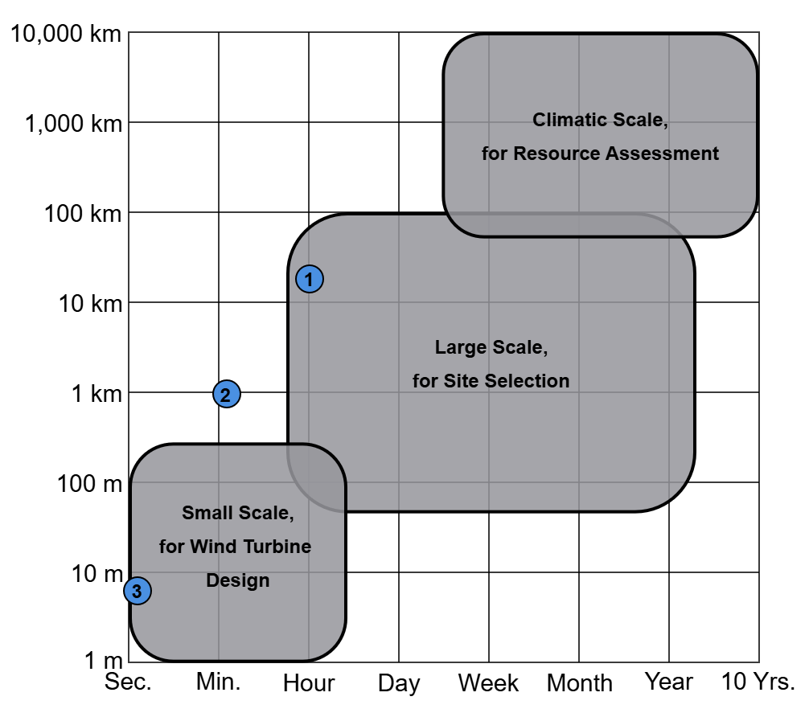
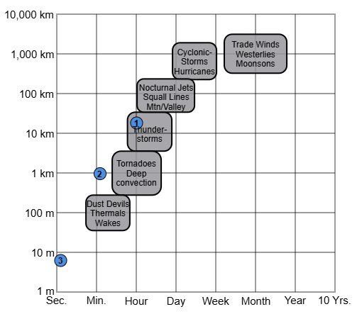

# Introduction

The growing demand for renewable energy has positioned wind power as a
key component of the global energy transition. Mexico, with its diverse
geography and climate, is uniquely positioned to harness this potential.
The Mexican government has committed to integrating 50% of renewable
sources into its electrical mix by 2050 [@dof2020acuerdo]. For the
2027-2037 period, it is projected that 88% of the installed capacity
will come from clean energy, with wind energy contributing 8.65%,
equivalent to approximately 3430.42 MW [@prospectivaSENER].

Mexico's geographic location, situated between the Pacific and Atlantic
Oceans, offers significant opportunities for both onshore and offshore
wind energy development. Key onshore regions with high wind velocities
include Oaxaca, Chiapas, Tamaulipas, Yucatan, and the Baja California
Peninsula [@amdeeProyectos]. Offshore opportunities have been identified
in the Yucatan Peninsula, the Gulf of Tehuantepec, and the eastern coast
of Tamaulipas
[@worldbankgroupOffshoreWindTechnical2020; @CANULREYES2022211].

Despite Mexico's vast wind energy potential, significant gaps remain in
understanding how the multi-scale complexity of wind impacts the
reliability of this renewable energy source, particularly for the
country's wind regimes. These gaps span from large-scale climatic
phenomena influencing wind farm operations to small-scale fluctuations
occurring within seconds, which affect the mechanical behavior of wind
turbines.

Wind energy research faces three grand challenges [@veers2019]:
understanding the physics of the atmosphere in regions where wind power
plants operate, improving the materials and system dynamics of wind
turbines, and optimizing the integration of wind farms into the
electricity grid. These challenges are inherently multi-scale, requiring
analysis across varying temporal and spatial dimensions due to the
complex and dynamic nature of wind behavior. These scales, as applied to
wind energy, are shown in @fig-atmospheric_scales and described as follows
[@sanz2017; @manwell]:

-   **Synoptic scales:** Spanning hundreds of kilometers and timescales
    from weeks to decades. These include tropical cyclones, monsoons,
    and climate change. The environmental information obtained at this
    scale helps identify wind resource variability and aids in spatial
    planning.

-   **Mesoscale:** Ranging from 100 m to 100 km and from hours to years.
    This scale encompasses thunderstorms, high- and low-pressure
    systems, and mountain-valley winds. It is particularly useful for
    specific resource assessment and determining site suitability.

-   **Small scales:** Covering the smallest spatial and temporal scales,
    as meters and milliseconds. These include turbulence, eddies, and
    gusts, which directly impact the mechanical loads on wind turbine
    components and their operational efficiency.

::: {#fig-atmospheric_scales layout-ncol=2}

Classification of temporal and spatial scales of wind energy
and topics addressed in this thesis. The blue dots indicate the spatial
and temporal locations of the topics addressed in this research, as
specified in @tbl-problem_approaches. Adapted from [@manwell].

:::

|   | General description                                                                     | Application           | Time frequency        |
|---|-----------------------------------------------------------------------------------------|-----------------------|-----------------------|
| 1 | Integrate wind and solar resources  into the energy mix                                 | Resource assessment   | Annual to daily       |
| 2 | Enhancement of reanalysis with  measured data and spatial variability of wind resources | Site selection        | Hourly to ten minutes |
| 3 | Dynamic analysis of an offshore wind turbine                                            | Technology assessment | Miliseconds           |

: Description of the topics addressed on this research. The spatial and temporal scales of the problems are also shown in @fig-atmospheric_scales. {#tbl-problem_approaches}

Understanding wind behavior requires the appropriate selection of
spatial scale and temporal frequency considering factors interacting
with the wind. For example, offshore wind turbines are influenced not
only by wind but also by waves, currents, and marine conditions, which
vary across different spatial and temporal scales. Similarly, onshore
wind farms must account for terrain effects, surface roughness, and
local weather patterns. High-resolution wind speed data is essential for
capturing these interactions and providing accurate assessments of wind
energy potential, turbine performance, and structural loads.

This thesis addresses three key challenges: the largest scale involves
understanding the dynamics of wind and solar resources and their
integration with regional electrical demand; the second analysis
combines actual data from different regions with meteorological models
to identify effective zones for model applications; the final
contribution take advantage of the smallest scale to analyze the effect
of specific site conditions over a wind turbine. @tbl-problem_approaches summarizes these challenges, which
are also represented in @fig-atmospheric_scales.

Wind energy research must be region-specific, as solutions are
constrained by factors such as resource characteristics, electricity
demand, geographic and climatic conditions, and infrastructure
availability. This thesis contributes to the field by providing
high-resolution data and adaptable analytical methodologies tailored to
Mexico's unique wind regimes. By equipping decision-makers with these
tools, this work aims to enhance the efficiency, reliability, and
long-term sustainability of wind energy integration in Mexico and
beyond.

## Objectives

The primary objective of this thesis is to assess how different temporal
resolutions of wind speed data influence the understanding of wind
energy challenges in Mexico. Specific objectives include:

1.  Evaluating the variability of wind and solar resources in the
    Yucatan Peninsula and their potential to meet regional electricity
    demand.

2.  Developing a methodology for enhancing the temporal resolution of
    reanalysis data for wind energy applications.

3.  Analyzing the performance and technical feasibility of a floating
    offshore wind turbine (FOWT) in the Gulf of Tehuantepec.

## Research contributions

This thesis is structured around three main contributions. First, the
study evaluates the variability of offshore wind and onshore solar
photovoltaic resources in the Yucatan Peninsula and their potential to
meet 50% and 80% of the region's electricity demand. Consumption
patterns are analyzed at daily, weekly, and monthly timescales, while
wind and solar production are estimated using ERA5 reanalysis data
[@ERA5] alongside electricity demand data from "Centro Nacional de
Control de la Energia" (CENACE). The findings provide insights into the
optimal sizing of installed capacity and identify periods of maximum
synchrony between renewable energy generation and demand.

Second, a methodology is developed to enhance the temporal resolution of
wind speed time series derived from the ERA5 reanalysis dataset. By
characterizing turbulent fluctuations from measured data, information is
added to the hourly reanalysis to generate ten-minute time series. The
methodology is validated using root mean square error (RMSE) and the
Pearson Correlation Coefficient. A spatial analysis is performed to
incorporate site-specific physical characteristics.

Finally, the thesis investigates the dynamic performance of a FOWT in
the Gulf of Tehuantepec. Meteorological and oceanic conditions in the
region are compared with those of the North Sea, and mechanical loads
are simulated using high-frequency wind and wave data. The study
emphasizes the critical role of sub-second resolution data in capturing
dynamic interactions and assessing the structural integrity of offshore
wind turbines.

## Thesis outline

This chapter contextualized the challenges addressed in the thesis,
emphasizing the influence of wind's spatial and temporal scales on wind
energy research. @sec-meth_data defines the study areas for each problem and
describes the data sources, theoretical concepts, and software used in
this research. The subsequent chapters present the literature review,
methodology, analysis, and results for each research contribution:
@sec-yucatan examines the complementarity between wind and
solar energy in the Yucatan Peninsula; @sec-enhancing_frequency introduces a methodology to
enhance the temporal resolution of reanalysis data; and @sec-tehuantepec evaluates the performance of a floating
offshore wind turbine in the Gulf of Tehuantepec. Finally, @sec-conclusions
synthesizes the findings and presents the conclusions of this research.
