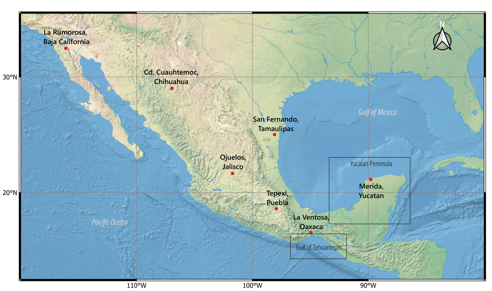
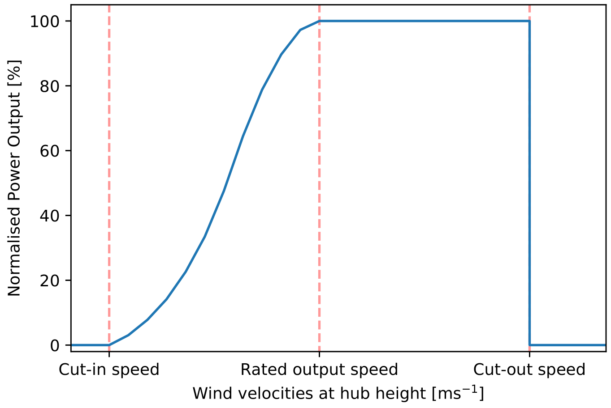
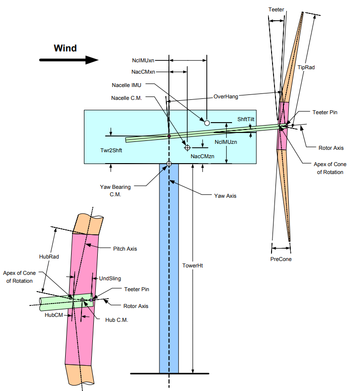

# Conceptual framework and data {#sec-meth_data}

This chapter describes the data and the conceptual framework utilized in
the following chapters. This research uses the ERA5 dataset as the
primary data source and also employs experimental data. Finally, the
software used in @sec-tehuantepec is introduced.

## Data and study area

The different approaches covered in this thesis require the manipulation
of diverse meteorological variables derived from distinct sources of
information, such as the ERA5 [@ERA5] reanalysis and measured data from
the "Atlas Eolico Mexicano" (AEM) project [@ineelAtlasEolicoMexicano].
These sources also have different time resolutions, with the lowest
resolution being hourly and the highest in the order of milliseconds.
The time resolution has been selected according to the specific problem
analyzed, and its details are thoroughly presented in the methodology
section of each of the following chapters. Data is summarized in @tbl-data,
and the application areas are shown in @fig-study_area.

::: {#fig-study_area}

Areas of application within Mexico of the topics in this
thesis. Points indicate the location of the towers from the AEM, used on
@sec-enhancing_frequency. The Yucatan Peninsula and the Gulf of
Tehuantepec areas are analyzed in @sec-yucatan and @sec-tehuantepec,
respectively.

:::

|                                         | Location                          | Variables from ERA5                                                                          | Variables from other sources                            |                |
|-----------------------------------------|-----------------------------------|----------------------------------------------------------------------------------------------|---------------------------------------------------------|----------------|
|                                         |                                   | Hourly frequency                                                                             | Variable                                                | Time frequency |
| @sec-yucatan             | Yucatan Peninsula                 | - Horizontal components of WS - Temperature - Solar radiation                                | - Electrical demand  obtained from CENACE @CENACE | Hourly         |
| @sec-enhancing_frequency | Points along  Mexican territory   | - Horizontal components of WS                                                                | - WS data from AEM @ineelAtlasEolicoMexicano      | 10 minutes     |
| @sec-tehuantepec         | Gulf of Tehuantepec and North Sea | - Horizontal components of WS - Significant wave heights - Wave direction - Wave peak period | - Wind fields generated with TurbSim                    | 50 miliseconds |

: Sources of information used on this thesis. Meteorological data is obtained from the ERA5 reanalysis, and observational data is collected from met towers. {#tbl-data}

### Observational data {#sec-aem}

The "Atlas Eolico Mexicano" (AEM) [@ineelAtlasEolicoMexicano] project
provides data at seven sites nationwide with a 10-minute resolution. The
locations are shown in @fig-study_area and specified in @tbl-sites. The
measurements were taken from sensors at 80 m above ground level. At most
sites, data is available from November 2017 to July 2020. For this
research, we used data only from 2018, as it is the year with the most
complete dataset across all sites.

| Site | Location                | Longitude | Latitude | Time Zone |
|------|-------------------------|:---------:|:--------:|:---------:|
| M01  | La Rumorosa, B. C.      |   -116.11 |    32.48 | UTC-08:00 |
| M02  | Merida, Yuc.            |    -89.78 |    21.14 | UTC-06:00 |
| M03  | Cd. Cuauhtémoc, Chih.   |   -106.95 |    29.02 | UTC-06:00 |
| M04  | CERTE, La Ventosa, Oax. |    -94.95 |    16.55 | UTC-06:00 |
| M05  | Ojuelos, Jal.           |   -101.71 |    21.67 | UTC-06:00 |
| M06  | San Fernando, Tamps.    |    -98.09 |    25.02 | UTC-06:00 |
| M07  | Tepexi, Pue.            |    -97.94 |    18.59 | UTC-06:00 |

: Locations of AEM meteorological tower sites in Mexico [@ineelAtlasEolicoMexicano]. {#tbl-sites}

### Reanalysis dataset

Wind energy applications require reliable data sources that provide
extensive temporal and regional descriptions of wind resources and other
meteorological variables. Reanalysis datasets serve this purpose by
offering long-term, consistent records of atmospheric conditions. A
reanalysis is defined as "the process whereby an unchanging data
assimilation system is used to provide a consistent reprocessing of
meteorological observations, typically spanning an extended segment of
the historical data record" [@MERRA2].

Reanalysis datasets offer key advantages for atmospheric research
[@reanalysis], providing spatially and temporally consistent data over
several decades. Each reanalysis is produced using a fixed configuration
of the numerical model, data assimilation scheme, and observational
input streams, ensuring internal consistency across the entire period.
This fixed framework allows reanalyses to assimilate extensive
observational data into a coherent representation of the atmospheric
state, facilitating the analysis of complex climate dynamics beyond the
capabilities of sparse observational records alone.

This thesis utilizes the ERA5 dataset [@ERA5], produced by the European
Centre for Medium-Range Weather Forecasts (ECMWF). ERA5 provides global
coverage at a spatial resolution of 0.25° x 0.25°,
approximately 31 km at the equator, and an hourly temporal resolution,
spanning several decades from 1940 to the present. The dataset is
generated through 4D-Var data assimilation, a method used to estimate
the best initial state of a system, like the atmosphere. It works by
adjusting the initial conditions of a numerical model so that, when the
model runs forward in time, its output stays close to the available
observations throughout a defined time window. This is done by
minimizing a cost function, using both the model's equations and the
observational data.

## Concepts

### Atmospheric Boundary Layer {#sec-abl}

The atmospheric boundary layer (ABL) is the lowest segment of the
atmosphere, where wind speed and other meteorological variables are
significantly influenced by surface roughness, atmospheric stability,
and, in coastal and oceanic regions, by wave momentum flux
[@coeff; @manwell].

In wind energy applications, accurate wind speed measurements at the
turbine hub height are crucial for optimal performance prediction. In
the absence of direct measurements using models that describe the wind
speed profile as a function of height within the ABL is commonly
employed. Two such models are the logarithmic profile and the power-law
profile, which provide distinct representations of the wind speed
gradient with height.

The logarithmic profile is frequently applied to model the wind speed in
the surface layer of the ABL, particularly under neutral stability
conditions. The model assumes that the wind speed increases
logarithmically with height, reflecting the influence of surface
roughness and turbulence. It is expressed as [@manwell]:

$$U(z) = \frac{U_*}{\kappa} \ln\left(\frac{z}{z_0}\right)$$ {#eq-log-profile}

where $U(z)$
is the wind speed at height $z$, $U_*$ is the friction velocity,
$\kappa$ is the von Kármán constant (approximately 0.4), and $z_0$ is
the roughness length, which is a function of the surface's roughness.
The logarithmic profile is most applicable in conditions where the
atmospheric flow is near neutral, with minimal stratification or
significant wind shear.

In contrast, the power-law profile is an empirical model that describes
the vertical wind speed profile based on the ratio of wind speeds at two
heights. It is defined as:

$$\frac{U(z)}{U(z_r)} = \left(\frac{z}{z_r}\right)^\alpha
$$ {#eq-power_law} 

where $U(z)$ is the wind speed at height $z$,
$U(z_r)$ is the reference wind speed at height $z_r$, and $\alpha$ is
the power-law exponent. The exponent $\alpha$ varies depending on
factors such as atmospheric stability and surface roughness, but it is
commonly set to 1/7 for onshore applications [@neutral_abl]. This model
is widely used in wind energy applications due to its simplicity and
flexibility. The power-law profile is particularly effective when
accurate data at multiple heights are unavailable, as it can be used
with just a reference wind speed at one height and a corresponding
power-law exponent.

In this thesis, the power-law profile is used to estimate wind speeds at
hub heights where wind speed data is not available. The selection of
this model is based on its suitability for the available data, as it
does not require the estimation of friction velocity or roughness
length. Furthermore, instead of using a constant value for the $\alpha$
exponent, a value is calculated for each time step based on the
available heights and then used to extrapolate to the required height.

### Power curve {#sec-power_curve}

The power curve is a fundamental characteristic of a wind turbine,
representing the relationship between the average wind speed at hub
height and the electrical power output. As shown in @fig-power_curve, a typical power curve identifies three
critical wind speeds:

-   **Cut-in wind speed**: The minimum wind speed at which the turbine
    begins generating power.

-   **Rated wind speed**: The wind speed at which the turbine reaches
    its maximum nominal power output.

-   **Cut-out wind speed**: The wind speed at which the turbine shuts
    down to prevent damage.

::: {#fig-power_curve}

Power curve for a typical wind turbine, highlighting cut-in, rated,
and cut-out wind speeds.

:::

The power curve, provided by the manufacturer, is used to estimate
energy production by evaluating wind speeds against the curve. This
curve typically represents the net electrical power output, meaning that
drivetrain and electrical losses are already included. However, it
remains an idealized representation, as it does not account for
site-specific factors such as turbulence or wake effects
[@wind_turbine].

### Annual energy production and capacity factor

The annual energy production (AEP) of a wind turbine represents the
total electrical energy generated over a one-year period. It is computed
by summing the power output, evaluated using the turbine's power curve
$P(U_t)$, across all time steps [@manwell]:

$$AEP = \sum_{t=1}^{N} P(U_t) \, \Delta t
$$ {#eq-aep}

where $N$ is the number of wind speed observations,
$U_t$ is the wind speed at time step $t$, and $\Delta t$ is the time
interval between successive observations, determined by the temporal
resolution of the dataset. Thus, if $\Delta t$ is constant, the total
time covered in the period is given by:

$$\text{Time} = \sum_{t=1}^{N} \Delta t = N \cdot \Delta t
$$ {#eq-period} 

The AEP is idealized and does not account for losses such as wake
effects, transmission inefficiencies, or turbine downtime due to
maintenance or curtailment.

The capacity factor (CF) quantifies the turbine's actual energy output
relative to the theoretical maximum it could produce if it operated at
nominal power throughout the entire period. It is defined as [@manwell]:

$$CF = \frac{AEP}{P_{\text{rated}} \cdot \text{Time}}
$$ {#eq-cf}

where $P_{\text{rated}}$ is the turbine's nominal power. The CF is a
measure of the performance of a wind turbine or wind farm at a specific
location, a 100% value indicates that the turbine is producing its
maximum power output over a given period, typically a year.

It is essential that the same time period is used when calculating both
AEP and CF to ensure consistency and comparability across different
turbines or sites.

### Estimation of solar production {#sec-solar_production}

The power output $P_{out}$ of a PV module with a rated power, $P_N$, a
power temperature coefficient, $\gamma$ and a rate coefficient $c_1$ is
calculated as:

$$P_{out} = \frac{G_t}{G_{STC}} \cdot P_N \cdot c_1 \left[1 + \frac{\gamma}{100}(T_{PV} - T_{STC})\right]
$$ {#eq-solar_power}

where $G_t$ and $G_{STC}$ are the solar
irradiances at the site and standard test conditions (STC),
respectively, and $T_{STC} = 25^\circ$ C. The PV module temperature
$T_{PV}$ is calculated as:

$$T_{PV} = T_a + G_t \cdot \frac{T_{PV, TETC} - T_{a, TETC}}{G_{TETC}}
$$ {@eq-temp_panel}

where $T_a$ is the ambient temperature,
$T_{PV, TETC} = 47^\circ$ C and $T_{a, TETC} = 20^\circ$ C are the
module and ambient temperatures at Temperature Estimation Test Condition
(TETC), and $G_{TETC} = 800$ W/m$^2$ is the irradiance at TETC.

### Damage equivalent load {#sec-del}

The damage equivalent load (DEL) represents a simplified measure of
fatigue damage commonly used in wind turbine analysis, by converting
varying load cycles into an equivalent constant amplitude load
[@grieve2022; @lee2005fatigue]. This allows quantifying the fatigue
loads experienced by a wind turbine due to external factors such as wind
and waves.

The ${DEL}_{M_{dir_{p}}}$ is the total damage equivalent load for all
events in wind direction *p* during 25 years, a typical lifetime for a
turbine, is defined as:

$$\text{DEL}_{M_{dir_{p}}} = \left( \sum_r P_r \left(\sum_i \frac{n_i M_i^k}{T_{sim}}\right) \right)^{1/k}
$$ {#eq-del}

where $P_r$ is the probability of occurrence of a load case $r$,
representing a specific combination of meteorological conditions. $n_i$
is the number of load cycles for the $i$-th event, obtained from a load
time series. $M_i$ is the magnitude of the load (e.g., bending moment or
stress) for the $i$-th event. $k$ is the fatigue exponent, a material
property that reflects the sensitivity of the material to fatigue
damage. $T_{\text{sim}}$ is the duration over which the load time series
is evaluated. This formulation aggregates the fatigue contributions from
all load events, scales them by their probabilities, and computes an
equivalent constant load.

## The OpenFAST software

OpenFAST is an open-source, multi-physics simulation tool developed by
the National Renewable Energy Laboratory (NREL) to model Fatigue,
Aerodynamics, Structures, and Turbulence of wind turbines
[@openfast_documentation]. It is widely used in the wind energy industry
and academy for analyzing the performance, structural loads, and
stability of both onshore and offshore wind turbines
[@fast_gov; @tranCFDStudyCoupled2018; @hashemiAssessmentHurricaneGenerated2021; @maWindwaveInducedDynamic2014; @moratoUltimateLoadsResponse2017a; @xuExtremeLoadsAnalysis2020; @papiTechnicalChallengesFloating2022].

To achieve realistic simulations, OpenFAST employs a multi-body dynamics
approach, where each component of the wind turbine such as blades,
tower, drivetrain, and foundation is modeled as a flexible or rigid body
with defined degrees of freedom. These components interact through
aerodynamic, hydrodynamic, and structural coupling, capturing the
intricate physics of turbine operation under various conditions.
OpenFAST solves the coupled equations of motion governing a wind turbine
system by integrating these multiple physical interactions.

OpenFAST requires detailed input data to initialize a simulation,
including turbine geometry, material properties, environmental
conditions such as wind and wave characteristics, and control system
parameters. The software processes these inputs and employs advanced
numerical solvers to iteratively compute structural deformations,
aerodynamic loads, and hydrodynamic interactions over time. @fig-turbine_sim presents a schematic of the wind turbine
model, illustrating key components such as the blades, hub, nacelle,
tower, and platform, along with relevant geometric and dynamic
parameters.

::: {#fig-turbine_sim}

Geometric layout of a wind turbine in OpenFAST, illustrating
key structural elements and reference distances such as tower height,
hub and nacelle positions, rotor axis orientation, and blade angles. Obtained from @singh2014simulation.

::: 

OpenFAST employs a time-domain approach to simulate turbine responses to
environmental conditions, including wind, waves, and currents. Advanced
numerical methods ensure accuracy and stability, even for highly complex
systems like floating offshore wind turbines. Once the simulation is
completed, the results can be analyzed to assess turbine performance,
identify potential structural stresses, and optimize design
configurations. Its modular design allows users to activate or
deactivate specific components depending on their analysis objectives.

The software's modular architecture enables users to model individual
components or simulate the entire turbine system based on specific
research and design needs. OpenFAST consists of several specialized
modules, each dedicated to a specific aspect of wind turbine modeling:

-   ElastoDyn: Models the structural dynamics of the turbine, including
    blade, tower, and drivetrain deformations. It captures the
    flexibility and interactions of these components using a modal
    representation.

-   AeroDyn: Simulates the aerodynamic forces on turbine blades,
    employing Blade Element Momentum (BEM) theory or Generalized Dynamic
    Wake (GDW) methods to compute lift, drag, and moments based on wind
    inflow conditions.

-   HydroDyn: Models hydrodynamic forces acting on offshore wind turbine
    foundations, accounting for wave loads, buoyancy, and added mass
    effects. It supports both fixed-bottom and floating offshore
    platforms.

-   ServoDyn: Simulates the turbine's control and protection systems,
    including pitch control, torque control, and emergency shutdown
    mechanisms. It enables users to implement custom control strategies.

-   TurbSim: Generates realistic turbulent wind fields for OpenFAST
    simulations, capturing spatial and temporal variations in wind
    speeds.

This section outlined the data sources and study areas relevant to the
problems addressed in this thesis. The theoretical framework was also
presented, providing the basis for the analyses performed in the
following chapters, where the treatment and analysis of data are
detailed in the respective methodology sections according to each
specific objective.
