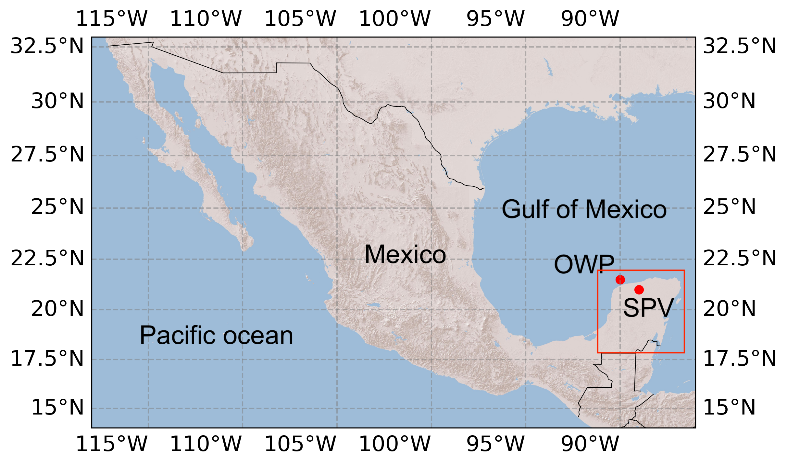
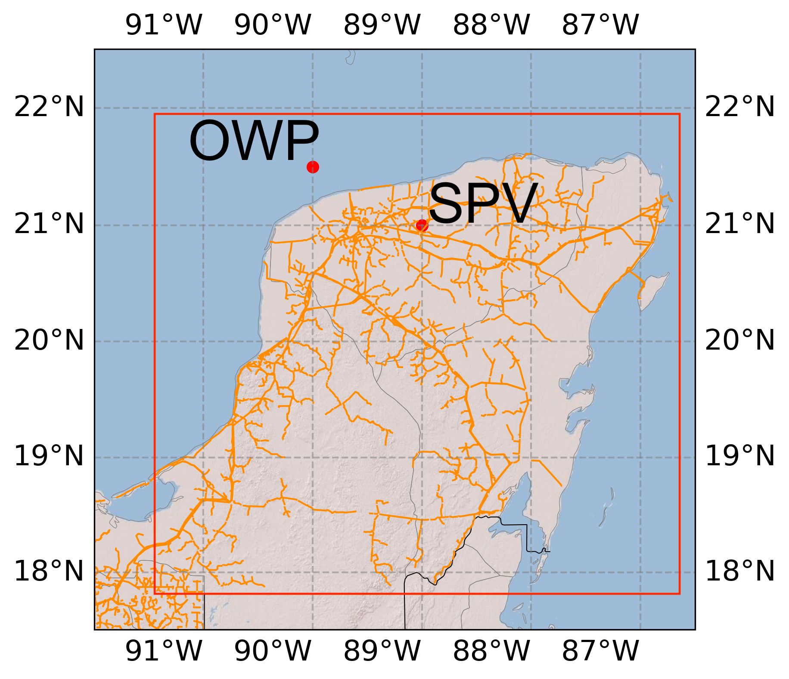
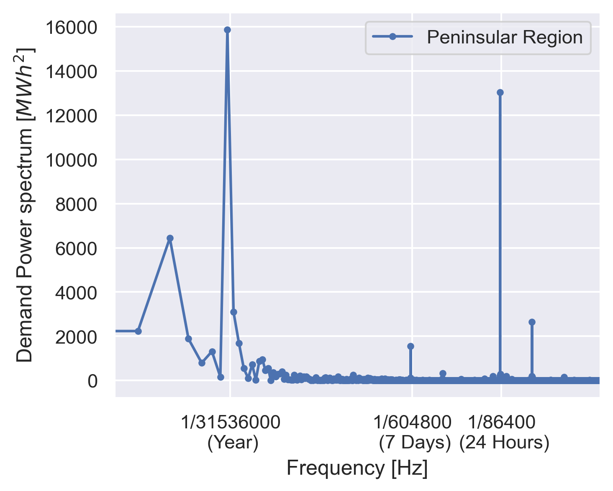
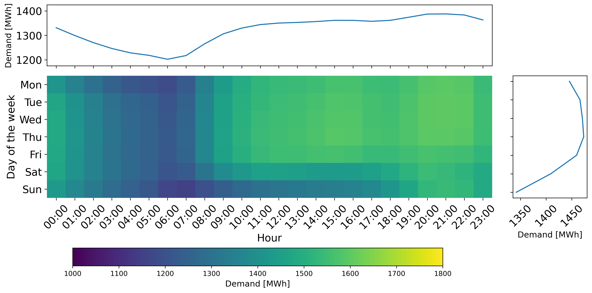
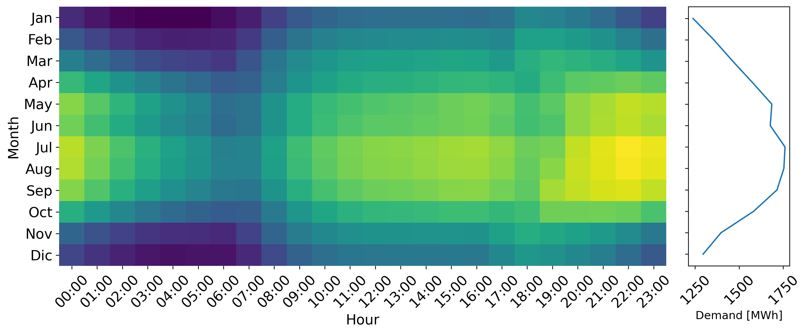
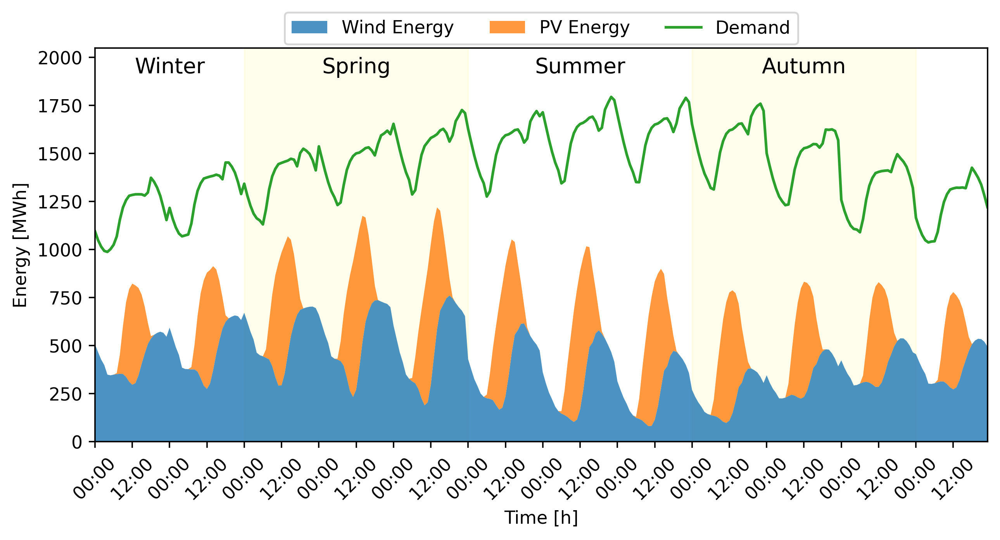
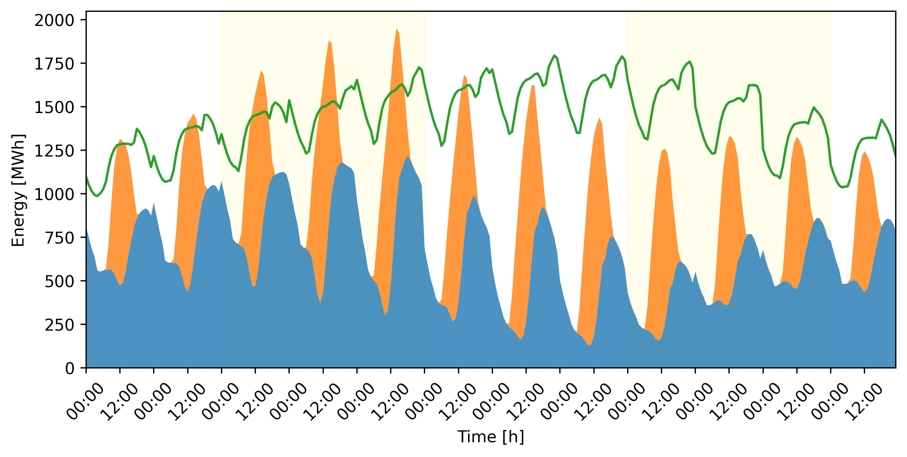

# Integration of wind and solar energy for electric demand in the Yucatan Peninsula {#sec-yucatan}

## Introduction

The global shift towards energy transition prominently features wind and
solar energy production as leading alternatives. These renewable sources
present generation costs that are on par with fossil fuel-based
electricity production [@IrenaCosts_2022]. Although these technologies
have reached significant levels of technical and economic development,
challenges remain in effectively integrating them due to issues such as
their variable nature and capacity to meet electricity demand.

Recently, Mexico has set greenhouse gas (GHG) reduction goals for 2050,
aiming to have clean energy constitute 50% of its electricity mix. With
the rise of electric vehicles, the demand for electricity will
necessitate substantial contributions from renewable sources, such as
wind and solar energy [@Castrejon-Campos.2022]. The extensive
integration of these variable energy sources will lead to modifications
in the transmission network, as its expansion will be pivotal in meeting
mitigation targets without limitations [@Miranda.2022hop]. In 2022, the
national transmission network in Mexico spanned 110,685 km, covering
nine control zones and an isolated system [@PRODESEN_2022], representing
a considerable challenge. Additionally, Mexico's large and diverse
landscape affects wind and solar resource availability, as their
potential varies by location and time, creating a unique challenge for
the regional integration of renewable energy sources.

The Yucatan Peninsula, situated in Mexico's southeast, primarily relies
on natural gas for electricity generation [@Navarro-Pineda.2017].
Although recent investigations have identified offshore wind potential
[@canul-reyesPotentialZonesOffshore2022], there is a lack of research on
how to incorporate these renewable resources into the region's power
grid. In the work by Magana-Gonzalez et al. [@Magana-Gonzalez.2023id],
the researchers analyze the spatial and temporal complementarity of
energies throughout Mexico. A significant finding emphasizes the Yucatan
Peninsula, where seasonal complementarity values are notably high.
Nevertheless, while this study focused on complementarity, it did not
explore specifics concerning installed capacity or energy output.

Meteorological modeling is increasingly recognized as a valuable
instrument for analyzing renewable energy production due to its ability
to deliver insights on key physical variables that influence power
generation over time and across regions, as well as their complementary
potential. Moreover, integrating these analyses with electricity demand
forecasts allows for the identification of the necessary technologies,
scale of installations, and storage capacities required to fulfill both
present and future regional energy demands.

A pioneering study investigating the interaction between wind and solar
resources took place in the United Kingdom [@Bett.2016]. The study
employed the ERA-Interim dataset to explore their combined effects on a
weekly and monthly basis, revealing substantial large-scale
complementarity.

A recent review by [@Weschenfelder.2020] offers a comprehensive overview
of complementarity analysis, particularly in integrating renewable
energy sources into power grids to decrease their variability. A
frequently explored strategy is the use of hybrid systems combining
photovoltaics, wind, and storage, which operate synergistically to
assist in meeting national emission reduction goals. This review
examines 41 studies, addressing typical data sources that range from
experimental to reanalysis data. The authors propose that using both
data types can enhance the accuracy of results, an assertion also
supported by [@Pedruzzi.2023]. They emphasize the significance of
conducting localized analyses and the need for a consistent reference
measure to assess complementarity effectively.

Pedruzzi et al. [@Pedruzzi.2023] delivered a comprehensive review on
complementarity analysis, centering on the interactions among diverse
renewable energy sources and proposing feasible technological
configurations. This analysis utilized a range of data types, including
temporal and spatial data from global mesoscale, microscale, and
experimental. It aimed to examine the variability inherent in these
energy sources and suggested complementary indices like Pearson,
Spearman, or similar. The authors underscored the necessity for
standardized methodologies in this domain while acknowledging that
certain situations might necessitate bespoke solutions.

The synergy between solar-PV and wind energy in China was analyzed using
temporal and spatial complementarity at various timescales: hourly,
daily, and monthly [@Sun.2023]. The study found potential synergy in
power production through the variability ratio, offering insights for
planning and integrating solar and wind power in the country.

Lindberg et al. [@Lindberg.2021] explored co-located solar and wind
energy plants using a combination of experimental data, mesoscale
modeling, and global wind speed datasets. Wind power was estimated based
on rotor-level wind speeds, while solar power calculations considered
irradiance and cloud cover. Factors such as solar cell technology, local
environmental conditions, and system design were identified as critical
to solar energy output. The study also highlighted the value of reliable
data and the analysis of resource-demand complementarity. Additional
work is needed to reduce uncertainties influencing the levelized cost of
energy (LCOE).

A study was conducted on combining offshore wind and solar energy
resources in the Belgian North Sea. This investigation utilized
Kendall's rank correlation and a 10-minute resolution time series,
incorporating data from DOWA and C3S climate projections from 2025 to
2100, on monthly, weekly, and daily scales [@Delbeke.2023]. The results
showed strong solar-wind complementarity on monthly and weekly
timescales, with a consistent seasonal pattern in resource availability.
These findings support the potential of hybrid offshore systems with
shared grid infrastructure to enhance renewable electricity generation
and integration.

A study by Fabry et al. [@Fabry.2023] analyzed complementarity on both
general and local scales. It found that integrating high renewable
energy into the grid requires aligning local demand fluctuations with
weather patterns. Energy demand follows daily, weekly, and annual
cycles, while wind, sun, and rain are less predictable, making energy
storage essential. Additionally, orography appears to enhance the local
correlation between wind and sun.

A case study in Kenya [@Muchiri.2023] revealed that renewable source
variability affects power grid stability, reliability, and quality.
However, wind and solar showed daily and monthly complementarity.
Similarly, Gulagi et al. researched wind-solar complementarity in
India's electric grid [@Gulagi.2020], underscoring the importance of
node connectivity for high renewable energy generation.

Given the need to study the complementarity between sources, Jani et al.
[@Jani.2022] presented a hybrid system based on wind and sun ERA5
reanalysis data; they presented a novel hybrid power exploitability
index based on peak and base demand scenarios.

A study conducted in China explored the interaction between wind and
solar energy through a study of MERRA2 reanalysis data using the Kendall
rank correlation coefficient [@Ren.2019]. This research revealed a
significant complementary relationship between these two energy sources.
However, it is crucial to consider technical constraints such as
electrical infrastructure when interpreting these findings. Therefore, a
thorough examination of local resources can provide valuable insight
into the unique electricity requirements of a region. Understanding how
wind and solar energy complement each other in a particular area can be
advantageous for making informed decisions when designing future energy
systems. A similar investigation conducted in Algeria assessed the
correlation between wind and solar energy using the Spearman correlation
coefficient. Although MERRA2 data was used for wind speeds, solar data
was obtained from the Copernicus Atmosphere Monitoring Service (CAMS)
radiation service because of its higher accuracy and better alignment
with on-site measurements compared to MERRA2. The results indicate
suitable regions; however, more research is necessary to determine the
specific energy demands of particular locations [@Guezgouz.2021].

Research in Portugal incorporates solar plants into existing wind
facilities to leverage grid connections and cut interconnection costs
[@Couto.2021]. The study used fifth-generation mesoscale model (MM5) for
wind speeds and photovoltaic geographic information system (PVGIS) for
solar data, analyzing hourly and monthly complementarity via Pearson's
correlation. Harrison-Atlas et al. [@Harrison-Atlas.2022] employed
National Solar Radiation Database (NSRDB) and Wind Integration National
Dataset (WIND) datasets to study a co-located wind and solar facility,
calculating Pearson, Spearman, and Kendall correlations, supported by
price data analysis.

Research performed in Australia over a ten-year period used data from
MERRA2 to investigate the interaction and directional dependence between
solar, wind, and battery systems [@Prasad.2021]. Wind speeds were
determined at an 80 m altitude using surface flux diagnostic techniques,
and temperature data were used to evaluate battery availability hours.
The analysis of interaction involved contrasting operational hours with
the total available hours within the dataset. The results highlighted
regions with promising energy production capacity and provided a
comprehensive analysis of battery storage systems with a thorough
approach.

The MM5 model was employed to assess the yearly and daily variations in
hourly wind patterns within Portugal. Solar information was sourced from
the PVGIS online resource for 2015 [@Couto.2020]. This study's
methodology enabled the recognition of ten unique regions throughout the
nation, each displaying different combinations of wind and solar
resources. The results underscore that combining various renewable
energy sources presents a sustainable strategy for planning the
country's decarbonization efforts.

The literature review highlights several key aspects: all examined
studies employ at least two distinct energy sources, specifically wind
velocities for both onshore wind power (WP) and offshore uses, as well
as solar irradiance for simulating photovoltaic systems (PV). The
predominant data sources employed include the ERA5, a fifth-generation
global climate atmospheric reanalysis from the European Centre for
Medium-Range Weather Forecasts (ECMWF) [@ERA5], and the Modern-Era
Retrospective Analysis for Research and Applications, Version 2 (MERRA2)
[@MERRA2]. The evaluation of complementarities involves computing an
index, with Pearson, Spearman, and Kendall coefficients being the most
frequently used. The timeframes often considered crucial for variability
analysis span daily, monthly, and seasonally. The findings relate to the
identification of areas with potential.

Located in southeastern Mexico, the Yucatan Peninsula stands out as a
promising site for combining OWP and PV technologies due to its high
potential for OWP, consistent wind-solar resources, and rising
electricity demand in the region. Nevertheless, there is a scarcity of
specific studies that factor in the region's electricity demand while
employing it as a foundational constraint to determine the necessary
installed capacities for meeting the demand over time. Being one of
Mexico's nine electric regions, analyzing this area will furnish crucial
insights for energy planning at the regional level.

This study examines the regional complementarity of offshore wind power
(OWP) and inland solar photovoltaic (PV) technologies in relation to
regional electricity demand from 2016 to 2020. When analyzing measured
regional electricity demand, the focus is placed on identifying patterns
on a monthly, weekly, and daily scale. Utilizing ERA5 reanalysis data,
the power output and capacity factor (CF) of offshore wind power (OWP)
and solar PV, both abundant in the region, are estimated. Based on this
analysis, an installed capacity is proposed to meet regional demand with
varying proportions of these technologies. These proportions offer
insights into local storage requirements, which are also explored in
this work.

The investigation started with an exploration of the data alongside the
methodology employed. Following this, components of a succinct
theoretical framework are introduced. The outcomes of electricity demand
patterns are examined and deliberated alongside wind and photovoltaic
capacity factor projections. These findings facilitate the determination
of installed capacities and their temporal progression to accommodate
distinct proportions of electrical demand. Ultimately, final remarks are
reached.

## Data and methodology

This section outlines the characteristics of the data and the analytical
techniques employed to examine the complementary solar and wind energy
resources available in the Yucatan Peninsula.

### Data description and pre-processing

The analysis was conducted using two primary data sources. The first
source provided observational data concerning electricity demand in the
peninsular region, while the second comprised meteorological variables
derived from ERA5 reanalysis interpolation. These data sets were
essential for estimating the production of wind turbine operation and
solar photovoltaic (PV) energy, along with the capacity factor (CF), at
two predetermined coordinates: 21.5°N, -90°W, which corresponds to the
offshore wind power (OWP) facility, and 21°N, -89°W, the location of the
Solar PV site, spanning the years from 1979 to 2020. These sites were
selected due to the notable complementarity demonstrated in previous
studies [@Magana-Gonzalez.2023id] and the plentiful resources available.
Red diamonds indicate the chosen locations in the illustration in
[3](#fig:mexico_southeast){reference-type="ref"
reference="fig:mexico_southeast"}.

<figure id="fig:mexico_southeast">
<figure id="fig:Mex">

<figcaption>Mexico, general overview</figcaption>
</figure>
<figure id="fig:Mex_sureste">

<figcaption>Southeaster electric region in the red
rectangle</figcaption>
</figure>
<figcaption>These figures shows the broad outline of Mexico (left side).
The southeastern electric region chosen for analysis is outlined in the
red rectangle. The electric grid in this area is depicted in orange,
with two specific locations marked by solid red circles for estimating
OWP and SPV capacity factors (right side).</figcaption>
</figure>

The Mexican National Energy Control Center (CENACE) offers hourly data
on documented electricity usage across each control zone within the
National Interconnected System (SIN). Information about the peninsular
region was gathered between 2016 and 2020 [@CENACE].

The timestamp of the ERA5 dataset was aligned with Mexico's time zone
through synchronization with electricity demand information. The
parameters derived from ERA5 included wind velocities $u$ and $v$ at an
altitude of 100 meters, solar irradiance, and air temperature at 2
meters above ground level. The wind velocities $w_s$ were computed by
combining the components $u$ and $v$. Thereafter, the wind speed at the
rotor's height, 119 meters, was projected using the power law profile.
Wind energy production was then determined using the power curve of the
DTU 10 MW reference wind turbine [@bc5f61cd4c51442f89eb02df89ab0aa4].
For solar power estimation, downward solar surface radiation and ambient
temperature at 2 meters were used to calculate solar photovoltaic
output. A 190 W solar panel [@zhangQuantitativeSynergyAssessment2018]
was chosen for technology evaluation.

### Methodology

The investigation proceeded through the following outlined steps.
According to existing research, a core relationship is observed between
electricity consumption and human actions, which fluctuate on seasonal,
weekly, and daily levels. Consequently, the initial phase of the
analysis involves examining the electricity demand time series within a
frequency domain. Based on these findings, the behavior of electricity
demand is then assessed over time. These findings are presented
initially.

The next stage of the study involves determining the average hourly
metrics for each month concerning regional electricity demand and the CF
of OWP and PV output. These metrics were calculated by averaging data
from identical hours across each day (e.g., 00:00, 01:00, \..., 22:00,
23:00) based on consistent timestamps for every month. This approach
facilitates the characterization of a representative year by the monthly
hourly averages. Spearman's correlation coefficient (SCC) was computed
to evaluate the relationship between wind and solar energy at
corresponding time intervals.

The installed capacity for each renewable technology is projected for
two distinct scenarios: one where 50% of the electricity demand is met,
and another where 80% is satisfied. This projection involves locating
the point within the derived time series for each resource where energy
production closely aligns with electrical demand, meaning the gap
between the peak energy generation of each renewable source and the
electricity consumption is minimized. Following this, the installed
capacity is estimated by computing the necessary capacity with the CF at
these specific instances to achieve the goals of the outlined scenarios.

## Results and discussion

Human activities significantly impact electricity demand across daily,
weekly, and annual periods. To effectively identify these patterns, the
electricity time series from the studied period was analyzed and
visualized using power spectrum analysis. Figure
[4](#fig:PS_P){reference-type="ref" reference="fig:PS_P"} illustrates
the presence of diurnal, weekly, and annual cycles in electricity
demand. While a 12-hour cycle is also noticeable, its amplitude is
smaller than that of the 24-hour cycle. Consequently, the 24-hour
contribution is prioritized in the time-scale analysis.

<figure id="fig:PS_P">

<figcaption>The power spectrum of electricity demand highlights daily,
weekly, and yearly cycles as key periods to match with renewable energy
integration.</figcaption>
</figure>

In Figure [7](#fig:ElectricDemand){reference-type="ref"
reference="fig:ElectricDemand"}, the electrical demand patterns in the
Yucatan peninsula are analyzed across various timescales such as hours,
days, and months. The upper plot
[\[fig:Day_vs_Hour\]](#fig:Day_vs_Hour){reference-type="ref"
reference="fig:Day_vs_Hour"} presents an analysis of demand distribution
during each day of the week relative to the hours, while the lower plot
[6](#fig:Monts_vs_Hour){reference-type="ref"
reference="fig:Monts_vs_Hour"} illustrates the demand variation across
months and hours. Areas with darker shades represent periods of low
demand, whereas lighter shades signify higher demand. Figure
[6](#fig:Monts_vs_Hour){reference-type="ref"
reference="fig:Monts_vs_Hour"} highlights two demand peaks: the first
occurring from 8:00 h to 17:00 h, followed by a minor decrease, and a
subsequent rise from 20:00 h until midnight. This trend is most notable
from May through September.

<figure id="fig:ElectricDemand">
<figure id="fig:Monts_vs_Hour">

<figure id="fig:Monts_vs_Hour">

<figcaption>Month vs Hour</figcaption>
</figure>
<figcaption>Month vs Hour</figcaption>
</figure>
<figcaption>Graph <a href="#fig:Day_vs_Hour" data-reference-type="ref"
data-reference="fig:Day_vs_Hour">[fig:Day_vs_Hour]</a> compares demand
across different days of the week and hours, while <a
href="#fig:Monts_vs_Hour" data-reference-type="ref"
data-reference="fig:Monts_vs_Hour">6</a> compares it across months and
hours. Consumption is highest during the daytime hours from Monday to
Friday, and peak demand occurs between 9:00 PM and midnight from May to
September.</figcaption>
</figure>

Analyzing the data on a weekly basis, Figure
[\[fig:Day_vs_Hour\]](#fig:Day_vs_Hour){reference-type="ref"
reference="fig:Day_vs_Hour"} demonstrates that maximum electricity usage
transpires from Monday to Friday. During these weekdays, demand
escalates from 6:00 a.m., peaking up to midnight, briefly declining
between 5:00 p.m. and 7:00 p.m., then rising again before tapering off
from midnight to 6:00 a.m. In contrast, energy consumption is reduced
throughout the day on weekends.

### Analysis of the renewable resources

Upon analysis of electricity consumption, Figure
[8](#fig:cf_resources){reference-type="ref"
reference="fig:cf_resources"} presents the monthly and hourly
fluctuations of Offshore Wind Power (OWP) capacity factor (CF) in blue
and solar photovoltaic (PV) CF in orange over consecutive days. The top
graph depicts hourly CFs for each renewable source across different
months. OWP displays a clear seasonal trend, achieving its highest CFs
in March and April, declining in August or September, and exhibiting a
varied production pattern from November to February. Solar PV maintains
a consistent performance throughout the year, peaking between May and
July, thus complementing OWP. The Spearman correlation coefficient
remains negative throughout the year but indicates greater potential for
complementarity during February, March, April, August, and September.

<figure id="fig:cf_resources">
<embed src="images/cf_resources_spearman.pdf" />
<figcaption>The technologies’ hourly CFs are displayed in both annual
(upper plot) and daily (lower plot) formats. OWP and Solar-PV are
denoted in blue and orange, respectively. The background diagrams show
the distribution of the capacity factor (CF), and the boxplots indicate
the quartiles of the data. The SCC is shown in red at each time
step</figcaption>
</figure>

In the daily analysis, Solar-PV generally follows a consistent
trajectory, peaking around midday. Conversely, the OWP shows its lowest
output from 04:00 to 13:00, subsequently increasing at 14:00 and
reaching maximum production around midnight. Notably, wind patterns
complement solar output, as evidenced by SCC showing negative readings
between 06:00 and 14:00, followed by positive readings. This transition
highlights the synergy between wind and solar energy from 15:00 to
18:00.

Regarding electricity demand alongside OWP and PV generation, it is
critical to highlight the notable lack of renewable energy generation
between 04:00 and 07:00, which coincides with a period of reduced
electricity demand. Moreover, demand peaks noticeably during daytime,
synchronizing with solar PV generation. Lastly, another demand peak
takes place between 19:00 and midnight, corresponding with high wind
energy availability.

### Proposed array technology diversification

An evaluation of installed capacity and its energy output is conducted
under two scenarios: one with a 50% electricity demand supply and
another with an 80% supply. The choice of the 80% supply level is based
on the hypothesis that the distribution could resemble a Pareto
distribution, where selecting 80% of the demand would result in demand
exceeding 20% by no more than 20% of the days. This analysis involves
examining two time series of representative monthly days, quantifying
the minimum distance between each variable and electricity demand to
achieve optimal synchronization. The peak synchronization points are
identified as April at 12:00 h for the solar-PV resource and March at
midnight for the OWP. With these minimal distances determined, installed
capacities are proposed to supply 50% and 80% of the demand exclusively
from renewable sources. The required capacities are presented in Table
[1](#tab:cap){reference-type="ref" reference="tab:cap"}.

::: {#tab:cap}
                 Installed Capacity (MW) 
  ------------ ------------------------- -----------------
  Technology             50% RE Scenario   80% RE Scenario
  PV                               950.2            1520.3
  OWP                              966.1            1545.7

  : Installed capacity needed to supply the 50% and 80% of the
  electricity demand by renewable energy.
:::

[]{#tab:cap label="tab:cap"}

Figure [11](#fig:mix){reference-type="ref" reference="fig:mix"} presents
typical daytime series for two scenarios. For the 50% scenario, the
contribution from OWP in blue and PV in orange consistently falls below
the electricity demand. Their energy output varies seasonally, peaking
in summer and spring but declining during autumn and winter.
Importantly, the trend shown by the SCC in figure
[8](#fig:cf_resources){reference-type="ref"
reference="fig:cf_resources"} is reflected in the peak values seen in
figures [9](#fig:50){reference-type="ref" reference="fig:50"} and
[10](#fig:80){reference-type="ref" reference="fig:80"} throughout the
day. Therefore, SCC results provide a dependable metric for assessing
resource complementarity.

<figure id="fig:mix">
<figure id="fig:50">

<figcaption>50% of renewable energy</figcaption>
</figure>
<figure id="fig:80">

<figcaption>80% of renewable energy</figcaption>
</figure>
<figcaption>Typical days per month of OWP and solar-PV are plotted in
blue and orange respectively. In green is represented the electricity
demand. Each group of hours on the x-axis corresponds to a typical day
of each month.</figcaption>
</figure>

The proposed technologies can be implemented within a conventional OWP
facility. Nevertheless, solar PV allows for energy production through
distributed generation due to the abundance of resources available in
the region.

In the 80% scenario, the OWP-PV generation surpasses the electricity
demand just 9% of the time, in alignment with Pareto's principle.
Batteries can be utilized to store a portion of the excess energy to be
used during the subsequent peak in demand, occurring from 19:00 to
midnight. This analysis, alongside energy efficiency strategies, may
also promote specific actions to mitigate the second peak.

The technical framework for implementing an 80% renewable energy
portfolio, consisting of OWP and PV systems, involves multiple aspects.
Primarily, it includes the deployment of 104 wind turbines, each with a
capacity of 15 MW. This plan is viable for two key reasons: the site is
located close to a densely populated area, facilitating energy
production near the demand center, and the availability of local port
facilities supports the feasibility of the project. The PV systems can
be developed using a distributed generation model. The target region
consists of the states of Campeche, Quintana Roo, and Yucatan, which
collectively include approximately 1,941,252 occupied private homes as
per the latest national census data. Thus, achieving the proposed PV
capacity can be realized by installing 1 kW per household throughout the
region, thanks to a reliable supply of resources.

It is important to acknowledge that ERA5 has a recognized bias that may
question the precision of the installed capacity findings. Nevertheless,
the real value of this analysis is in understanding the system's
behavior to maintain a steady energy supply for the future.

## Key insights

Several countries, with Mexico among them, are working towards reducing
carbon emissions in their electricity networks. Mexico has reiterated
its commitment to reaching 50% clean energy by 2050, capitalizing on its
ample solar and wind resources. Nevertheless, there is a scarcity of
studies focusing on the integration of temporal and spatial variability
of renewable energy with local demand, underscoring the necessity for
further research. In this study, the variability of electricity demand
in the Yucatan peninsula was analyzed across daily, weekly, and seasonal
periods. Additionally, solar and wind resources were assessed over daily
and annual periods to understand their correlation with electrical
demand using reanalysis data. A straightforward method was developed to
examine scenarios of installed capacity based on demand curves and
renewable energy supply. Specifically, monthly days were identified
where there are minimal discrepancies between renewable energy supply
and day-to-day demand, choosing two scenarios that aim to meet 50% or
80% of the capacity on days with the smallest differences for each
renewable type. The outcomes suggest that daily, weekly, and seasonal
analyses are effective. Peak demand occurs during daylight hours,
dropping slightly between 5:00 PM and 7:00 PM with a decline on weekend
days. An increase was identified from May to September. The Spearman
correlation coefficient serves as a valuable tool to identify the
complementarity and synergy of the studied resources. The ERA5
reanalysis dataset has played a crucial role in enhancing our
understanding of the behavior and dynamics of renewable sources, despite
its biases. The combination of offshore wind and solar photovoltaic
energy represents a viable sustainable alternative for the Yucatan
peninsula, supporting high levels of renewable energy integration with
well-developed technologies. Initial results outline potential renewable
energy configurations needed to reach significant penetration levels
within electricity systems, emphasizing that the proposed methodology is
easily adaptable to other renewable energy solutions aimed at meeting
specific regional demands.
