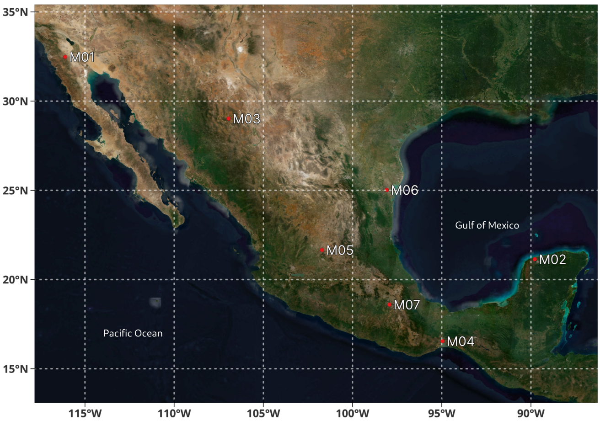
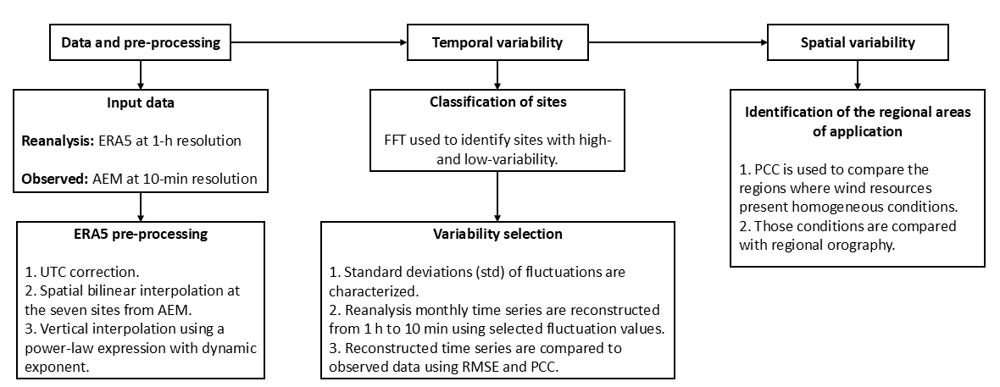
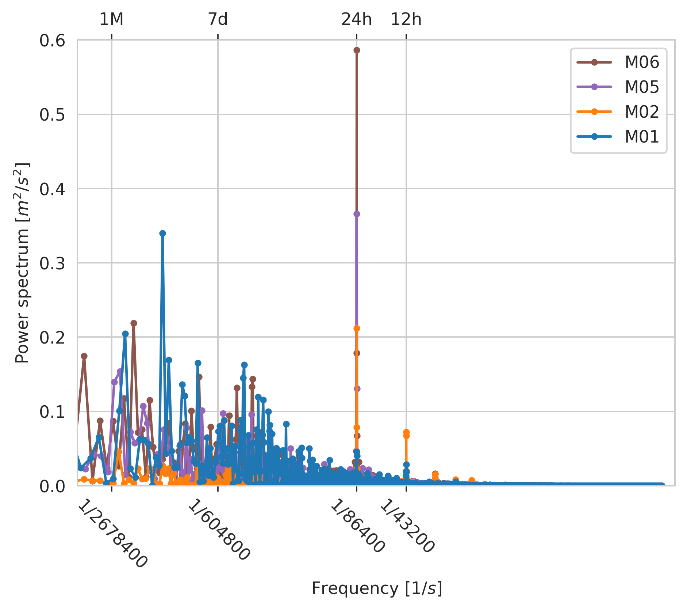
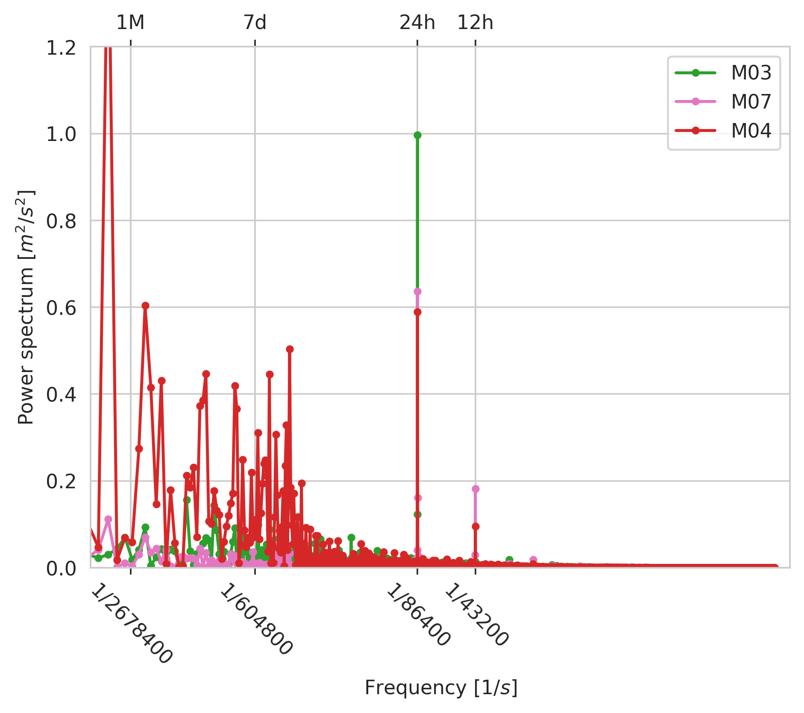
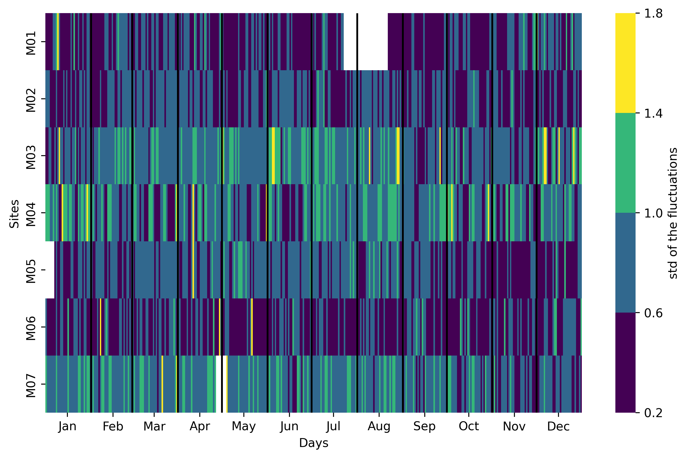
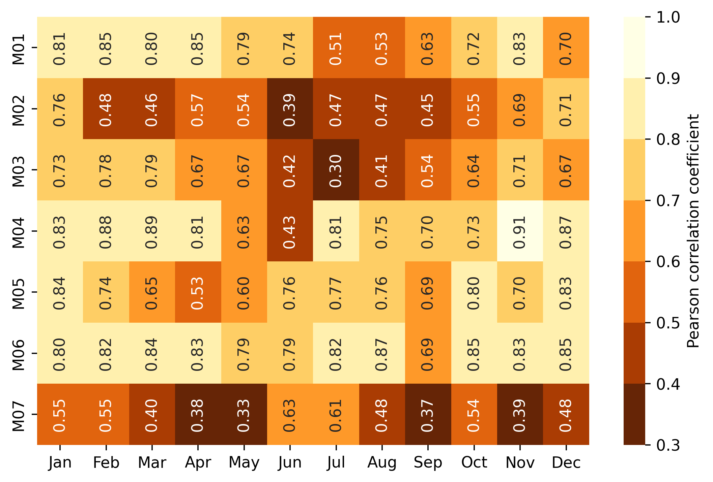
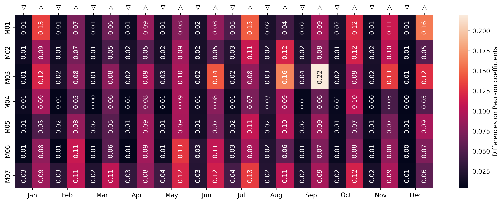
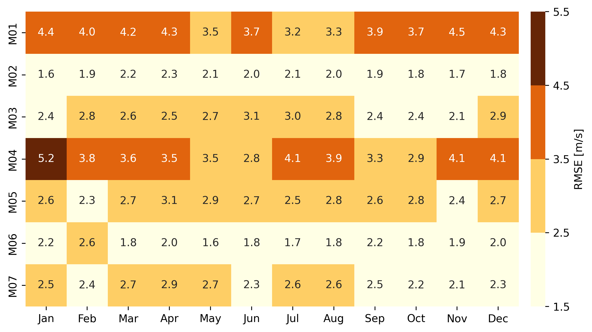
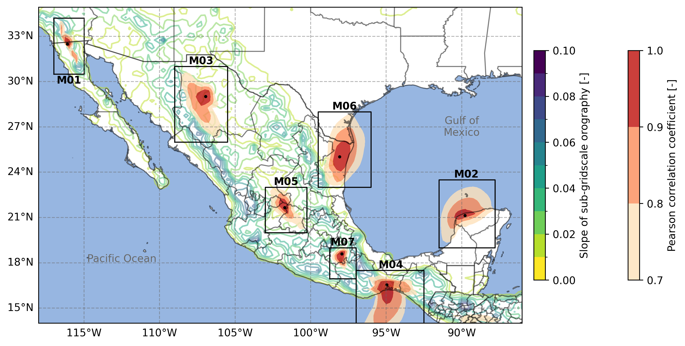
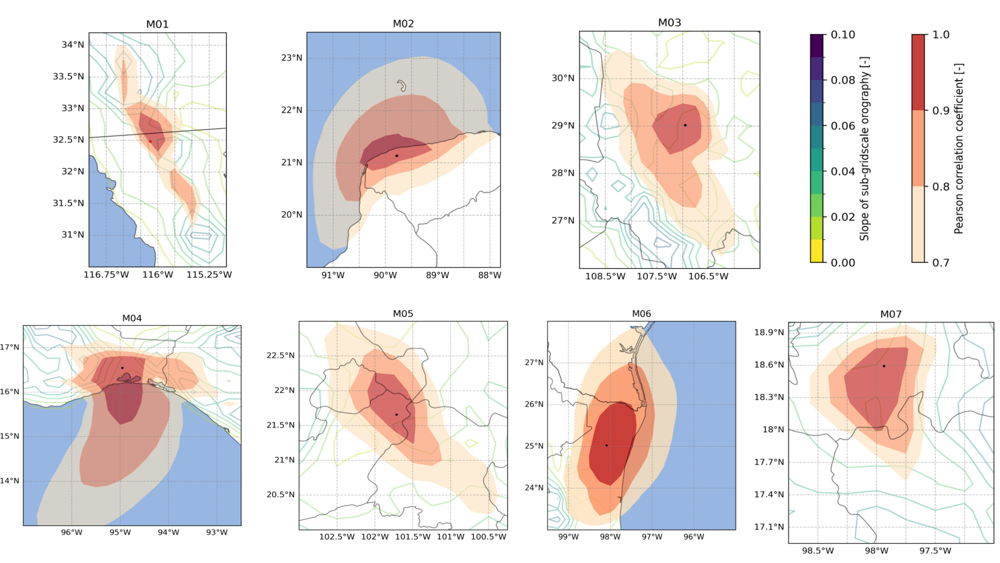

# Wind speed variability: temporal and spatial analysis {#sec-enhancing_frequency}

## Introduction {#sec-intro}

Wind variability is a result of the wind's complex nature; these changes
are manifested at different time scales that range from years and months
to seconds, with inter-scale variability across those time frames. Their
effects on wind turbine performance are manifested in different wind
energy variables, from annual energy production to energy quality.
Evaluating the impact of variable wind speeds on wind energy production
involves assessing their performance under these conditions. This
analysis helps us understand wind speeds behavior and pinpoint potential
risks in scenarios with high variability. In particular, dynamical
analyzes in the field of wind energy require capturing the turbulent
scale to perform short-term simulations of mechanical, electrical, and
aeroelastic components to assess the performance of wind turbines under
specific environmental conditions
[@hashemiAssessmentHurricaneGenerated2021; @papiUncertaintyQuantificationEffects2020; @hafeleImprovedTwostepSoilstructure2016].

Short-term fluctuations can influence the performance and fatigue of
wind turbines in the wind. Turbine performance and fatigue are based on
dynamic studies and require high-frequency data to describe wind speed
dynamics and capture these variations
accurately [@hollingWindEnergyImpact2014]. The methodologies for
generating those signals can include Monte Carlo simulations
[@damicoFirstSecondOrder2013], data-driven models
[@dambrosioDataDrivenGeneration2022], probabilistic approaches
[@bokdeComparisonReconstructionMethods2019], or statistical techniques
based on the distribution of the wind speeds and their variability
[@rosales2024]. The time series data used in these simulations are
typically generated using synthetic signals to represent the variability
of the wind. However, a caveat is that such signals are commonly not
related to local wind conditions. With the method proposed here, the
performance of particular technologies would be tested under local
variability, ensuring its robustness.

Reliable data on renewable resources, such as solar, wind, or wave
energy, are necessary to develop feasibility analyses related to the
performance of the technology in a region [@coxRenewableEnergyData2018].
Reanalyses data sets are valuable for assessing technology performance.
In addition, they contribute to the modeling of renewable energy
resources by providing consistent long-term data relevant to a
particular local area [@wuGlobalTypicalMeteorological2023].

Reanalysis data sets combine observations and a numerical model through
a data assimilation process [@fujiwaraIntroductionSPARCReanalysis2017]
available for several decades in the past. The ERA5 [@ERA5] and MERRA2
[@gelaroModernEraRetrospectiveAnalysis2017] reanalyses are the most
widely used in the wind energy industry, due to their hourly temporal
and their spatial resolution of approximately 30 km and 50 km,
respectively. For wind energy applications, global reanalyses have
demonstrated their accuracy for predicting wind resource patterns and
velocities in both offshore and onshore locations
[@gualtieriAnalysingUncertaintiesReanalysis2022]. In other studies, the
variability of wind resource reanalysis has been used to study wind
speed conditions and power production in different regions
[@morales-ruvalcabaEstimatingWindSpeed2020a; @CANULREYES2022211; @carrasco-diazAssessmentWindPower2015],
or to analyze the complementarity between wind and solar resources
[@Magana-Gonzalez.2023id], for example. The ERA5 reanalysis has been
shown to correlate well with observational data in some Mexican
locations
[@thomasHowWellAtmospheric2021; @lopez-villalobosEffectsWindPower2021].
However, two key facts must be addressed regarding the use of reanalysis
in wind energy studies. Firstly, these data have temporal and spatial
resolution limitations, which may not be sufficient to accurately
capture the high-resolution variability of wind speed and its effects on
wind turbines [@kissComparisonWindPower2009]. Secondly, reanalyses
exhibit an underestimation bias and can present larger errors in coastal
and mountainous regions [@POTISOMPORN20234781]. Upon correction and when
experimental data are accessible, the reliability of the reanalysis data
is enhanced, and the uncertainties related to the modeled phenomena are
diminished
[@staffellUsingBiascorrectedReanalysis2016; @gruberGlobalValidationWind2022].

Recent studies in enhancing wind speeds' temporal or spatial resolution
from reanalyses involve using machine learning techniques to generate
predictive models
[@wes-9-821-2024; @hu2023downscaling; @adytia2024deep]. These approaches
utilize vast amounts of reanalysis and measured data to train predictive
models that require extensive datasets for training and higher
computational resources.

Considering that some applications, such as dynamic analysis, require
high-resolution datasets that are often unrelated to local conditions
and the strong capability demonstrated by reanalysis data in replicating
long-term conditions in specific regions of Mexico, in this study, we
introduce a methodology to improve the hourly time resolution of
reanalysis time series to 10-minutes, by identifying temporal
fluctuations in wind speed from a year of actual data in seven regions
in Mexico. The reconstruction is based on the analysis of temporal and
spatial variability. The temporal analysis allows for the
characterization of the variability throughout the year. In contrast,
the spatial analysis identifies regions with similar wind resources and
delimits where the method can be applied. This approach links regional
experimental information to add it to the reanalysis' wind speed time
series.

In Mexico, the goal is to transition to a sustainable energy system,
aiming for 50% clean energy sources in the electricity mix by 2050
[@dof2020acuerdo]. As of 2022, the country had an installed wind
capacity of 7,317 MW, concentrated in two key regions: the Tehuantepec
Isthmus in Oaxaca and Tamaulipas, which together account for 37.7% and
23.4% of the total installed wind capacity, respectively
[@amdeeProyectos]. Mexico plans to further increase its clean energy
capacity, adding 88% from 2027 to 2037, with wind energy contributing
8.65% of this total, equating to approximately 3,430.42 MW
[@prospectivaSENER]. These regions are particularly rich in onshore and
offshore wind resources, making them ideal for implementing the
methodology proposed in this study. However, despite the potential of
renewable sources, insufficient investment in research, development, and
innovation of renewable energy technologies may limit Mexico's ability
to meet its renewable energy goals [@CASTREJONCAMPOS202229]. Given the
diverse environments across the country, linking short-term fluctuations
to regional characteristics enables the development of customized
technological solutions.

The structure of the paper is as follows: First, the general methodology
is introduced, including the identification of temporal and spatial
variability through power spectrum analysis. This is followed by a
detailed explanation of the resolution improvement method and a
description of the reanalysis and experimental datasets. The subsequent
section discusses the results, and finally, the conclusions are
summarized.

## Data and methodology {#sec-meth}

### Data and pre-processing {#sec-preprocess}

Observational data is obtained from the "Atlas Eolico Mexicano" (AEM)
project described on @sec-aem.
Data from the seven sites during 2018 is used; the sites are shown on
@fig-map_aem. Measurements were taken from sensors at 80 m
above ground level at 1 Hz and averaged every 10 minutes, which is the
resolution considered in this research.

::: {#fig-map_aem}

Location of the sites provided by the AEM project. The specific location of each met tower is described in @tbl-sites.

:::

The reanalysis used in this investigation is the ERA5 hourly data on
single levels for 2018 with a horizontal resolution of
$0.25° \times 0.25°$. The horizontal components of wind
speed at $10~m$ and $100~m$ were obtained from ERA5 to calculate the
wind speed magnitude and then bilinearly interpolated to obtain an
hourly time series at the tower's geographic locations. The time zones
were then corrected from UTC-0 to the local time zone. Finally, the wind
speeds were extrapolated vertically to the measured heights using the
power law's empirical expression described in @sec-abl.
The coefficient $\alpha$, is calculated at each time step using the wind
speeds at 10 m and 100 m provided by the ERA5 dataset. It is derived by
applying the power law profile relationship, as expressed in @eq-power_law, using the ratio between the two heights and
their corresponding wind speeds.

### Methodology

The first stage of the methodology is to characterize the fluctuations
in wind speed and their temporal and spatial variability. In this work,
fluctuations are defined as the difference between each value at a
10-minute resolution and its hourly average; meanwhile, the variability
is represented by the standard deviation of the fluctuations. To
characterize those components, first, a temporal and spatial variability
analysis of the wind speed data is performed to select suitable values
per region, and then, the reconstruction method is implemented based on
a statistical analysis described in the following section.

The reconstruction method relies on finding the optimal period of
observations needed to characterize the fluctuations and accurately fit
a probability density function (pdf). This aspect is examined more
carefully, given the importance of time-series length on wind power
estimates demonstrated by previous studies [@Gross2020]. The initial
phase involves an analysis of time-dependent variability, aiming to
identify the specific time periods that have the most significant impact
on experimental wind variability. To accomplish this, the power spectrum
of the experimental time series is estimated and examined using a Fast
Fourier Transform (FFT). With this information, the typical variability
is studied in each location, and the enhanced ERA5 resolution time
series is compared with the actual data. Subsequently, a spatial
analysis is performed to identify regions with similar wind conditions
where reconstruction can be implemented. This will offer an additional
criterion for time-up-resolution reliability. Finally, an example is
presented as a study case to discuss the method's effectiveness.

The described methodology is applied to the seven sites where data was
collected. For the temporal analysis, the daily fluctuating components
of wind speeds from the observed data are calculated for each day of the
year as described in the next section on @eq-turbulent_obs. Then, the effectiveness of the
reanalysis in reproducing the data at those specific sites is evaluated
using the Pearson Correlation Coefficient (PCC) and the Root Mean Square
Error (RMSE). The RMSE and PCC are used as complementary metrics to
evaluate both the magnitude of errors and the similarity in temporal
patterns between the reconstructed and observed data.

For the spatial analysis, the reanalysis wind speeds during 2018 were
first interpolated at the seven specific sites. Then a spatial grid was
generated, in which the interpolated time series from each site were
repeated at all points of the grid within the reanalysis domain. The PCC
between the original reanalysis data and the newly generated grid with
replicated time series was then calculated. This process was repeated by
varying the wind speed time series for each site. Finally, a spatial
classification is carried out between areas with a similar high PCC
around each site. The methodology described in this section is
summarized in @fig-diagram.

{#fig-diagram}

### Theory {#sec-theory}

The reconstruction methodology consists of using high temporal
resolution wind speed observations from meteorological tower
measurements (Met), $u_{obs}$, to enhance the temporal resolution of the
hourly wind speed ERA5 reanalyses, $u_{ren}$, obtained from a bilinear
interpolation at the location of the Met towers.

We assume the wind speed, $u$, can be decomposed into a mean and a
fluctuating (turbulent) component [@popeTurbulentFlows2000]:

$$u = \overline{u}+u'
$$ {#eq-turbulent_flow}

where $\overline{u}$ is the mean and
$u'$ is a fluctuating component. Because $u_{obs}$ is the time series
with high temporal resolution, first, the mean values are obtained at
the same resolution of $u_{ren}$, which is hourly. This average is named
$\overline{u}_{obs}$. Then, the fluctuation of each observation at its
original frequency is calculated, $u_{obs}'$:

$$u_{obs}'=u_{obs}-\overline{u}_{obs}
$$ {#eq-turbulent_obs}

These fluctuations can be characterized by a normal probability density
function (pdf) [@mcnerneyMarkovMethodSimulating1985], also identified in
our findings. Based on the normal pdf obtained, wind speed fluctuations
with a random distribution at the resolution of the observations,
$u'_{pdf}$, are reconstructed and subsequently added to $u{ren}$:

$$u_{new} = u_{ren}+u'_{pdf}
$$ {#eq-new_time}

Given that the average of $u'_{pdf}$ is zero, implicitly in equation @eq-new_time, it is assumed that $u_{ren}$ are equal to the
hourly mean of $u_{new}$. The fluctuations of $u_{new}$ are randomly
obtained from the characterized pdf and have the resolution of the
observations. With this strategy, $u_{ren}$ data is enriched by adding
velocity fluctuations whose distributions coincide with $u'_{obs}$. This
apparent increased resolution is a consequence of incorporating
information from the observations to the reanalysis data. Then, in a
one-hour interval between times $t_h$ and $t_{h+1}$, there are six data
points with mean $u_{ren}(t_h)$ and six normally distributed
fluctuations obtained from $u'_{pdf}$. The variables introduced in the
methodology are summarized in @tbl-variables.

| Variable             | Meaning                                                      | Status     |
|----------------------|--------------------------------------------------------------|------------|
| $u_{obs}$            | Measured WS                                                  | Input      |
| $u_{ren}$            | Hourly WS from the reanalysis                                | Input      |
| $\overline{u}_{obs}$ | Hourly mean of the observed WS                               | Calculated |
| $u_{obs}'$           | Fluctuation of the observed WS, obtained from an hourly mean | Calculated |
| $u'_{pdf}$           | Fluctuations from the pdf                                    | Calculated |
| $u_{new}$            | New high frequency WS                                        | Output     |                             Output

:  Wind Speed (WS) Variables introduced in the Methodology section. {#tbl-variables}

## Results and discussion {#sec-case_studies}

### Power spectrum analysis

The initial aspect analyzed is the power spectrum of the experimental
time series of the seven sites, as illustrated in @fig-power_spectrums. Across these locations, the diurnal
cycle is evident, although with varying intensities. Based on this, the
daily cycle is selected as the frequency to analyze the variability. The
stations are categorized into two groups reflecting low and high
variability. Specifically, towers M01, M02, M05, and M06 exhibit lower
variability @fig-grupobajo, whereas the other stations are classified
as having higher variability @fig-grupoalto.

::: {#fig-power_spectrums layout-ncol=2}

{#fig-grupobajo}

{#fig-grupoalto}

Monthly, Weekly, Daily, and Half-Day cycles for each location. Stations were classified into two groups according to their diurnal spectrum magnitude. 

:::

### Temporal variability

The subsequent element of our analysis focuses on the temporal
variability throughout the year, characterized by the daily standard
deviations (std) of the fluctuations. @fig-std_anual illustrates the stds for each site,
considering both the annual temporal progression and the number of days
that show this degree of dispersion. The figure on the left, @fig-Var_Month,
shows the changes in standard deviation over the year for each site.
Lighter hues correlate with higher variability, while darker hues
indicate lower variability. Note that the previous classification based
on the variability magnitude remains consistent, as lighter colors are
still prominent at the same sites.

In @fig-Var_cuentas, the number of days associated with
different levels of variability is shown for each site to determine
their frequency. Analysis within defined variability ranges reveals that
all sites predominantly exhibit low values, whereas high values are
found mainly among the high-variability group.

::: {#fig-std_anual layout-ncol=2}

{#fig-Var_Month}

{#fig-Var_cuentas}

Daily std values of the wind speed fluctuations. Blank spaces indicate missing data.

:::

### Variability selection

In this section, an analysis of specific ranges of variability is
studied. For each month and location, the maximum and minimum values
were identified and then used to reconstruct the interpolated ERA5 time
series. Now, two analysis criteria are used, first the PCC between the
hourly interpolated ERA5 and the experimental wind speeds, shown in
@fig-pearson_1h. This is done to identify how well wind
speeds are reproduced at each location. Next, for every minimum-maximum
pair of the std values, the time series reconstructions from one hour to
ten minutes resolution were performed and subsequently compared against
the experimental time series by estimating the Pearson correlation
coefficient (PCC). @fig-differences_pearson illustrates the variations in the
monthly PCC values when using the minimum and maximum for
reconstruction. The right columns at each month show that using the
maximum values of the stds gives higher differences in the PCC values
since the dispersion on the reconstructed series increases while using
the minimum values maintains the original correlation.

::: {#fig-differences_pearson layout-ncol=2}

{#fig-pearson_1h}

{#fig-differences_pearson}

The left columns at each month (▽) indicate using the reconstruction methodology with the min std, and the right columns (△) are max std.

:::

After analyzing the temporal correlations, the RMSE values were
calculated between the 10-minute observational time series and each
reconstructed series using both maximum and minimum dispersion values.
These results help identify the most effective dispersion values for
reconstructing the time series. Notably, the analysis revealed that
across all locations, the smallest errors were consistently observed
when using the minimum monthly fluctuation values.

@fig-RMSE illustrates the RMSE between the 10-minute experimental time series and
the reconstructed series based on minimum dispersion values. In general,
the M01 and M04 sites exhibit higher RMSE values compared to the other
locations. These larger errors are likely influenced by geographical
factors. For instance, M01 is located in a region characterized by
complex terrain, which increases variability and reduces reconstruction
accuracy. In contrast, the elevated RMSE at the M04 site may be
attributed to frequent high wind speeds and ERA5's known underestimation
bias in such conditions, contributing to the observed error index.

::: {#fig-RMSE}

 

Monthly RMSE between 10-min experimental time series and the
reconstructed by using minimum dispersion
values.

:::

Reconstructed time series of wind speeds using minimum and maximum
dispersion approaches can occasionally result in negative values of wind
speeds, particularly when reanalysis wind speeds are near zero. This
issue is likely due to the underestimation inherent in the reanalysis
data since fluctuations were characterized by observed data. When
applying the minimum dispersion method, the occurrence of negative
values is generally less than 1% for most months across the analyzed
sites. In contrast, the maximum dispersion cases lead to a more frequent
occurrence of negative wind speed magnitudes. Obviously, negative wind
speed magnitudes are unrealistic, but given the small frequency of
events for low variability, the existence of these cases is considered
tolerable and focuses further analysis on these cases.

### Spatial Variability

After conducting the variability analysis from both magnitude and
temporal viewpoints, the next step involves examining the regional
similarity of wind speeds. This is done to pinpoint areas with
comparable wind conditions, suggesting potential sites for the
reconstruction methodology's application. @fig-PCC_regional illustrates the PCCs between the ERA5 data
at the mast location and the surrounding domain points. The range of
correlation values between 0.7 and 1.0 are shown. It has been noted that
as the distance from the mast being correlated increases, the
correlation values tend to decrease, suggesting a geographic influence.

::: {#fig-PCC_regional}

Spatial variability of annual wind speeds using the PCC as an indicator.

:::

As a supplement to the analysis, the slope of sub-grid scale orography
from the ERA5 dataset is depicted for each location. Sub-grid scale
orography refers to terrain features such as valleys, hills, and small
mountains that are smaller than the model grid resolution and therefore
not directly resolved [@era_web]. Instead, their effects are
parameterized using features derived from higher-resolution elevation
data. In this study, the slope parameter is used as an indicator of
terrain complexity. Higher slope values reflect more rugged or irregular
topography, while lower values correspond to flatter landscapes. The
parameter across Mexico is shown in
@fig-PCC_regional. This makes sub-grid orography a useful
proxy for assessing how local terrain variations may influence wind
patterns. The analysis shows that topography significantly affects areas
with high correlation: complex terrains, such as those in M01, are
associated with smaller high-correlation regions, whereas flatter areas
like M02 or M06 exhibit more homogeneous, extensive zones.

The topographic influence over the homogeneity of wind resources helps
define the areas where the reconstruction method can be applied, under
the assumption that wind speed fluctuations and variability remain
similar within regions with high PCC. In this context, the methodology
can be applied using observational data that fall within these
identified zones of homogeneity. However, it is important to note that
the method does not improve the correlation between reanalysis and
observational data. Therefore, before applying the resolution
enhancement, users should ensure that the reanalysis data and the
observational series at the location of interest are already highly
correlated.

### Reconstruction example

Previous analyses demonstrate that the minimum value of the daily stds
for each month can be properly used to increase the reanalysis wind
speed time series from one hour to ten minutes, maintaining values
nearly the original Pearson coefficient between the reanalysis and the
actual data. @tbl-final_std shows the mentioned values of the stds.

|     |  Jan |  Feb |  Mar |  Apr |  May |  Jun |  Jul |  Aug |  Sep |  Oct |  Nov |  Dec |
|-----|-----:|-----:|-----:|-----:|-----:|-----:|-----:|-----:|-----:|-----:|-----:|-----:|
| M01 | 0.37 | 0.39 | 0.36 | 0.37 | 0.38 | 0.37 | 0.46 | 0.29 | 0.31 | 0.37 | 0.37 | 0.36 |
| M02 | 0.40 | 0.32 | 0.42 | 0.45 | 0.36 | 0.48 | 0.45 | 0.47 | 0.40 | 0.35 | 0.43 | 0.36 |
| M03 | 0.39 | 0.59 | 0.53 | 0.62 | 0.67 | 0.56 | 0.64 | 0.49 | 0.47 | 0.48 | 0.46 | 0.36 |
| M04 | 0.54 | 0.36 | 0.35 | 0.40 | 0.37 | 0.37 | 0.49 | 0.66 | 0.42 | 0.44 | 0.41 | 0.38 |
| M05 | 0.39 | 0.42 | 0.54 | 0.49 | 0.45 | 0.47 | 0.49 | 0.48 | 0.43 | 0.33 | 0.38 | 0.33 |
| M06 | 0.33 | 0.39 | 0.29 | 0.40 | 0.42 | 0.47 | 0.49 | 0.45 | 0.44 | 0.39 | 0.37 | 0.35 |
| M07 | 0.61 | 0.59 | 0.60 | 0.69 | 0.61 | 0.47 | 0.66 | 0.56 | 0.46 | 0.46 | 0.45 | 0.40 |

: Values of the monthly std fluctuations recommended to create a
  10-minute time series from the hourly ERA5. {#tbl-final_std} 

As previously assumed, the fluctuations of the wind speeds present a
normal distribution with zero mean; therefore, only the std varies
between sites and time. These values can be used by users interested in
creating a high-frequency time series from reanalysis.

For example, @fig-example_m03 shows, for the site M03 during January,
the actual data at a 10-minute frequency and the hourly reanalysis. To
increase the frequency of the reanalysis, we should use the std value
from @tbl-final_std corresponding to that month and site, in
this case, 0.39.

{#fig-example_m03}

## Key insights

This study introduces a methodology to enhance the temporal resolution
of ERA5 reanalysis data using a statistical approach that characterizes
wind speed fluctuations and variability at seven sites in Mexico. The
analysis of variability was conducted through both temporal and spatial
assessments. An analysis of the power spectrum showed that the diurnal
cycle is the main frequency affecting fluctuations in wind speed.
Consequently, the research divided the locations into two categories:
high variability (M03, M04, M07) and low variability (M01, M02, M05,
M06). The temporal analysis demonstrated that using the minimum daily
standard deviation of wind speed fluctuations provided optimal results
for reconstructing high-frequency time series while maintaining PCC
values. Error analysis using RMSE confirmed alignment with power
spectrum data, categorizing locations by high and low variability and
emphasizing the importance of considering orography to minimize error
rates. Terrains that are more intricate, as those where M01 and M04
stations are located, showed increased errors, while smoother terrains
displayed reduced error rates. Orography significantly impacts the
regions where the methodology is applicable, with more extensive areas
noticed in the north-eastern and south-eastern stations, regions
recognized as flat terrains. Spatial analysis confirmed that the
characterized standard deviations could be applied effectively in
regions with similar PCC values, making this method particularly
suitable for areas where the reanalysis data show high correlations with
local observations. These findings support the viability of this
methodology in improving temporal resolution in reanalysis data sets.
