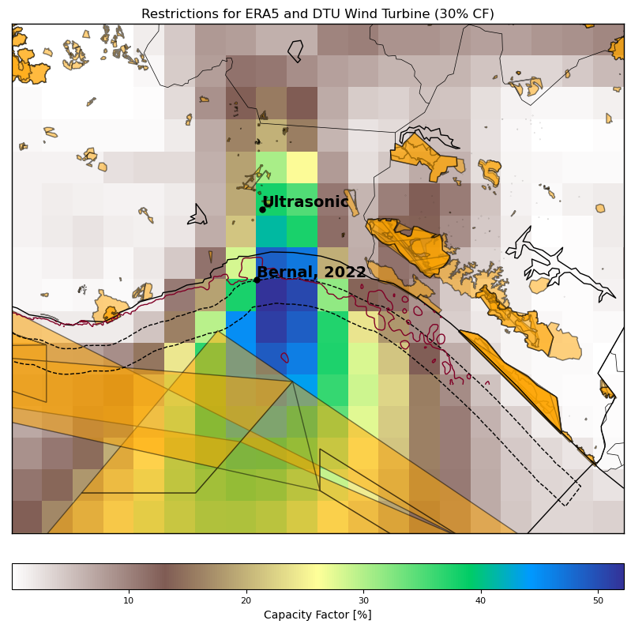
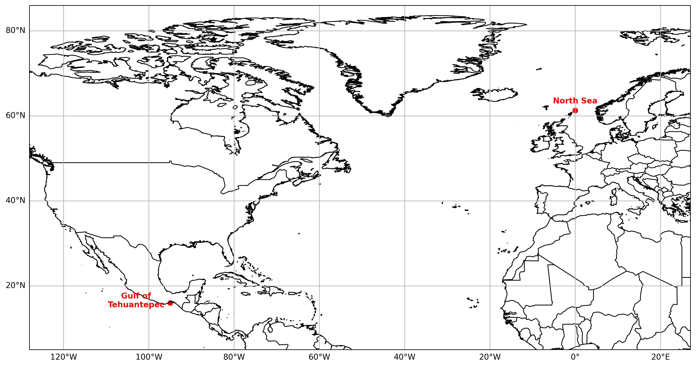
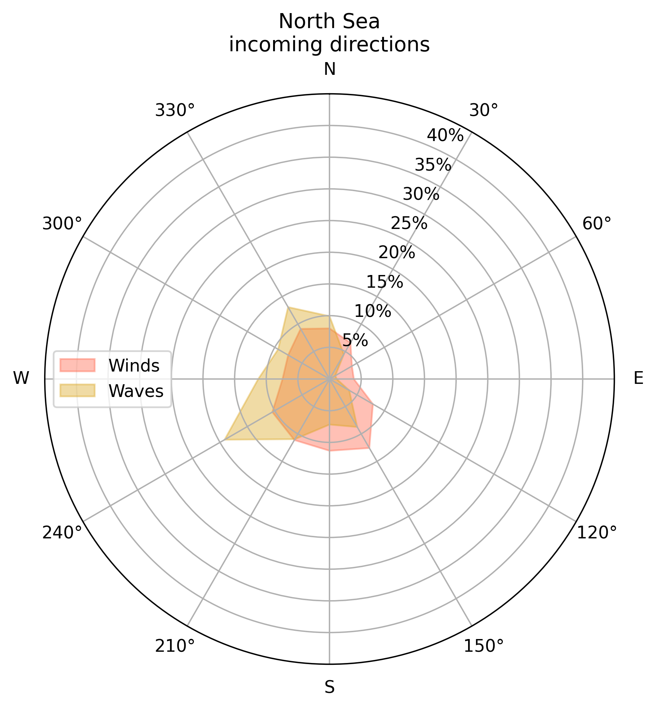

# Performance of an offshore wind turbine in the Gulf of Tehuantepec {#sec-tehuantepec}

## Introduction

Offshore wind energy is gaining increasing attention as a promising
renewable energy source due to its significant advantages over
traditional fossil fuels. Offshore wind turbines can take advantage of
higher and more consistent wind speeds, resulting in higher energy
output than their onshore counterparts. In recent years, there has been
a growing trend toward installing new offshore wind facilities globally
[@gwr_2024], with increasing investments and technological advancements
in offshore wind energy.

In Mexico, some studies have been performed to assess the technical and
economic feasibility of offshore wind in the Gulf of Mexico and the
Pacific Ocean
[@CANULREYES2022211; @arenas-lopezAnalysisOffshoreWind2022; @hernandezgalvezHarnessingOffshoreWind2022].
According to the World Bank Group
[@worldbankgroupOffshoreWindTechnical2020], there are four zones
suitable for floating offshore wind technology (FOWT) in the country:
the Gulf of California, the eastern region of Tamaulipas, the northern
region of the Yucatan Peninsula, and the southern region of Oaxaca at
the Gulf of Tehuantepec being this last zone the area with the highest
wind resources on the country.

The conditions in the Gulf of Tehuantepec include high wind speeds
[@romero-centenoIsthmusTehuantepecWind2003] and high water depth
[@gebco], which allows for exploring the technical feasibility of
floating platforms. This work aims to analyze the performance of an
offshore wind turbine and its platform in the Gulf of Tehuantepec by
analyzing the energy produced and structural loads due to the wind and
sea conditions. Next, a review of studies about dynamic analysis of
offshore wind turbines is given and summarized in @tbl-review.

Robertson and Jonkman [@robertsonLoadsAnalysisSeveral2011] analyzed the
dynamic response of six offshore platforms for a 5 MW wind turbine
according to the IEC 61400-3 design standard located on the northern
North Sea. These platforms are the MIT/NREL tension leg platform,
OC3-Hywind spar, ITI energy barge, UMaine tension leg platform,
UMaine-Hywind spar, and UMaine semi-submersible. For the different
analyses on each platform, the specifications of the wind turbine and
the metocean data were the same. Also, the properties of every structure
and the mooring system designs were required to develop a fully dynamic
model for each one. With this model, the loads analysis is performed to
identify the ultimate loads and fatigue loads by simulating a set of
load cases. With those results, the systems' dynamic response is
characterized and compared with a land-based system.

The load cases presented on [@robertsonLoadsAnalysisSeveral2011]
consider different scenarios, including power production under normal
operation and with fault occurrences, parked with and without faults,
using normal and extreme turbulence models, and wind conditions. The
different combinations of the scenarios give a total of 2,190
simulations for each offshore platform model. Results were presented in
terms of the ratio between the resulting loads from the floating systems
by the corresponding values from the land-based analysis. For the
ultimate loads, the transverse bending moments of the blade root, the
low-speed shaft at the main bearing, the yaw bearing, and the tower base
were analyzed. For fatigue loads, simulations were performed for the
in-plane and out-of-plane blade root bending moments, the 0°
and 90° low-speed-shaft bending moments at the main bearing,
and the side-to-side and fore-aft bending moments in the yaw bearing and
in the tower base.

Tran and Kim [@tranCFDStudyCoupled2018] conducted a CFD simulation of
the OC4 DeepCwind semi-submersible platform for the NREL 5MW turbine
with the objective of analyzing the influences between floating platform
motions and wind turbine aerodynamic performance considering the
influence of wind and waves. Results were compared with an OpenFAST
simulation. They analyze the surge, heave, pitch, and mooring line
tension response along the thrust and power coefficients under an
operating condition. Also, aerodynamic loads at different positions of
the tower were obtained. Their findings highlight the importance of
accurately capturing unsteady aerodynamic and hydrodynamic interactions,
as these significantly affect platform motion, aerodynamic loads, and
mooring tension, with notable differences observed between CFD and FAST
simulations under coupled wind-wave conditions.

Hashemi et al. [@hashemiAssessmentHurricaneGenerated2021] simulated the
effects of wind and wave loads generated by the hurricanes Carol and
1938, with peak wind velocities of 49 and 45 m/s, respectively. They
used a monopile offshore wind turbine located on the US East Coast to
assess the sub-structural response to load variability. Using OpenFAST,
they analyzed the total tower base moment at the monopile base and the
displacement at the transition point of the tower and the monopile
structure.

Zambrano et al. [@zambranoDynamicModelingDeepwater2006] analyzed the
motion response of a floating structure designed to support three wind
turbines. It was performed under different storm conditions of the sea
states in the Gulf of Mexico. Analysis of the floating platform's
response amplitude operator was carried out for surge, heave, and pitch
for those conditions and for two proposed turbines.

The feasibility of a floating offshore wind farm in United Arab Emirates
was studied by Al Qubaisi et al. [@alqubaisiFeasibilityStudyDesign2018].
The criteria for the selection of the site include the water depth and
wind speed; for the proposed location, the water depth is between 10 and
30 m, and the average wind speed above 5.4 m/s. Costs of the
installation were estimated and compared with the Gemini offshore wind
farm located in the Netherlands. The study does not analyze the
performance of the proposed technology under the site conditions.

In the Tehuantepec Isthmus, Bernal Camacho et al.
[@bernal-camachoTechnicalAssessmentOffshore2022] estimated the wind
potential of the 5 MW NREL wind turbine and analyzed the dynamic
behavior of the semisubmersible OC4 DeepCwind platform through numerical
analysis using ANSYS, under the following environmental scenarios: the
highest probability of occurrence and the most extreme conditions
(Hurricane Barbara, 2019). Results analyze the variations in the heave,
pitch, and surge of the platform under those conditions in terms of the
displacement of the center of gravity (CG) and the parameter $d/a$ where
$a$ is the distance from the keel to the upper deck of the external
floats, and $d$ is the required draft. For extreme conditions, authors
consider necessary the use of safety and stabilization methods.

| Reference | Gap | Technology tested | Site conditions | Baseline | Comparison criteria |
|-----------|-----|-------------------|------------------|----------|---------------------|
| Robertson and Jonkman, 2011 @robertsonLoadsAnalysisSeveral2011 | Understand the fundamental design trade-off between the different concepts | NREL offshore 5MW with the MIT/NREL TLP, UMaine TLP, OC3 Hywind spar, UMain spar, UMaine semisubmersible, ITI Energy barge | North Sea | NREL 5MW land based | Sea-to-land ratio of Blade-Root Bending Moment, Low-Speed-Shaft Bending Moment, Yaw-Bearing Bending Moment, Tower-Base Bending Moment, Blade-Root Bending Moment In-Plane, Blade-Root Bending Moment Out-of-Plane, Low-Speed-Shaft Bending Moment 0°, Low-Speed-Shaft Bending Moment 90°, Yaw-Bearing Bending Moment Side-to-Side, Yaw-Bearing Bending Moment Fore-Aft, Tower-Base Bending Moment Side-to-Side, Tower-Base Bending Moment Fore-Aft |
| Ma et al., 2014 @maWindwaveInducedDynamic2014 | Dynamic response of a FOWT under different environmental conditions using a numerical simulation method | 5MW turbine with OC3-Hywind spar-type structure | Specific conditions of waves (T=10s, H=6m) and wind velocity of 11.4 m/s |  | Loads on Tower base of wind-wave, wave-only. Power spectrum of platform heave, surge and pitch motions by wind-wave and wave-only |
| Morató et al., 2017 @moratoUltimateLoadsResponse2017a | Identify the potential relevant design load cases from the IEC for sub-structure design | NREL 5MW monopile from the OC3 project | Ijmuiden shallow water site, Dutch North Sea |  | Parameters for the design of the rotor/nacelle assembly and the support structure: flapwise (out-of-plane), and edgewise (in-plane) moment at the root of the blade, the overturning moment at the seabed (mudline moment), pitch angle, and GenTq |
| Tran and Kim, 2018 @tranCFDStudyCoupled2018 | Develop a high-fidelity fluid-structure simulation considering aero-hydrodynamic coupling due to the dynamic motion of a FOWT | DeepCwind semisubmersible floating platform with the NREL 5MW turbine | Specific conditions: wind speed 11 m/s, rotor speed 11.89 rpm, wave height 7.14 m, wave period 14.3 s | Results compared with a FAST simulation | Surge, heave and pitch motions, mooring cable tension, thrust and power coefficients, platform surge response, blade root force and moment, tower base force considering Tower only and Blades+Tower+Nacelle |
| Xu et al., 2020 @xuExtremeLoadsAnalysis2020 | Develop an average conditional exceedance rate method for estimating extreme loads on FOWT | NREL 5MW turbine on the DeepCwind semi-submersible platform | Cape Elizabeth, US coast |  | Out-of-plane bending moment, tower-base side-to-side and fore-aft bending moments, anchor tension |
| Hashemi et al., 2021 @hashemiAssessmentHurricaneGenerated2021 | Characterize the spatial variability of extreme wind and wave loads under hurricane conditions | 5MW offshore monopile | US east coast | % change relative to mean of five spatial points | Total tower base moment at the monopile base (reactMYss) and platform displacement (PtfmSurge) |
| Papi and Bachini, 2022 @papiTechnicalChallengesFloating2022 | Analyze technical implications of upscaling floating wind turbines and impacts on floater, mooring, and ancillaries | IEA 15 MW and NREL 5 MW, both on the DeepCWind semi-submersible platform | Average metocean data from US west coast | Comparison between the two turbines. Ratio offshore/onshore | RAOs of heave, pitch, surge; ratio offshore/onshore of GenPwr, GenTq, RotSpeed, RotThrust, RtAeroFxh, TwrBsMyt, TwrBsMxt, TwrBsFxt, YawBrFxp, YawBrMyp, YawBrMxp, TipDxc1–3, TTDspFA, TipDyc1–3, TTDspSS, RootMxb1–3, RootMyb1–3 |
| Bernal-Camacho et al., 2022 @bernal-camachoTechnicalAssessmentOffshore2022 | Assess feasibility of a floating platform under Gulf of Tehuantepec wave and wind conditions | OC4 DeepCwind semisubmersible platform | Most probable and most extreme conditions at Gulf of Tehuantepec |  | RAOs of surge, heave, and pitch of the platform for different d/a combinations; platform displacement |

: Literature review on dynamical analysis of offshore wind turbines. {#tbl-review}

Previous studies give an overview of relevant parameters to be analyzed
on wind turbine performance. This study presents a performance analysis
of a floating offshore wind turbine under the specific metocean
conditions of the Tehuantepec Isthmus, using the OpenFAST software.
Those relevant conditions, characterized by wind speeds, peak (or mean)
wave period, significant wave height, and wind and wave directions, are
obtained from the ERA5 reanalysis dataset. Due to the lack of studies on
offshore wind turbine performance in Mexico, particularly on floating
technology, the results are compared with the same technology in
metocean conditions in the North Sea. The assessment presented in this
research will facilitate direct comparisons with established offshore
wind installations at other locations, providing decision-makers with
valuable insights into the prospective future of wind energy in the
region.

The chapter is structured as follows. @sec-data_meth_tehuantepec
describes the location and characteristics of the sites, technology and
data, also, the methodology to delimit the cases is given. The analysis
and comparison of the results are presented in @sec-results_tehuantepec, and
finally, @sec-conc_tehuantepec presents the conclusions.

## Data and methodology {#sec-data_meth_tehuantepec}

### Study area and baseline

The study area for this research is delimited to the Gulf of
Tehuantepec, located on the southeast side of Mexico on the Pacific
Ocean, as shown in @fig-map_mexico. The interest in this site, as previously
described, is due to the high wind velocities present throughout the
year. @fig-map_restrictions shows the delimitation of potential
areas using the same methodology as in [@CANULREYES2022211]; however,
the bathymetry until 50 m, indicated by a red line is very near the
coast, and higher velocities are away the coast, with a higher depth,
therefore, in this study, the performance of a FOWT technology is
evaluated.

The turbine's performance at the proposed site will be compared with the
same technology but in a different place; since there are no other
offshore facilities in Mexico, a baseline site in the North Sea is
proposed. The study zone and the baseline site are shown in @fig-map_baseline. Both sites present ocean depth
conditions for FOWT, usually above 50 m. For the selected locations, the
water depth at the Gulf of Tehuantepec and the North Sea is 83 m and 168
m, respectively [@gebco].

::: {#fig-maps_group layout="[[1,1], [1]]"}

{#fig-map_mexico}

{#fig-map_restrictions}

{#fig-map_baseline}

@fig-map_mexico shows the delimitation of the study area at the Gulf of Tehuantepec, located on Mexico’s southeast. @fig-map_restrictions shows the delimitation of potential areas using the same methodology as in @CANULREYES2022211: dashed lines indicate the distance from the coast until 44 km, yellow polygons indicate natural protected areas, and the red line shows the bathymetry until 50 m depth. @fig-map_baseline shows the location of the study area and the baseline site used to compare the performance of the technology.

:::

### Data

To analyze the effects of fatigue on the device during a typical
turbine's lifetime, data from 25 years was used. The metocean data was
obtained from the ERA5 reanalysis dataset from 1996 to 2020 with an
hourly resolution, using a bi-linear interpolation at the points
indicated in @fig-map_baseline. The next variables were extracted:

-   Significant wave height \[m\]

-   Peak wave period \[s\]

-   Wave direction \[°\]

-   Wind direction \[°\]

-   Wind speed \[m/s\]

The technology selected to evaluate its performance was the 15-MW
offshore reference wind turbine developed by NREL
[@evangaertnerDefinitionIEAWind2020] with the UMaine semisubmersible
platform [@allenDefinitionUMaineVolturnUSS2020]. The main parameters of
the turbine and the platform are shown in @tbl-turbine_par, and a schematic diagram is shown in
@fig-turbine_diagram.

| Parameter                |                     Value |
|--------------------------|--------------------------:|
| Turbine rating [MW]      |                        15 |
| Turbine class [-]        |              IEC Class 1B |
| Hub height [m]           |                       150 |
| Rotor diameter [m]       |                       240 |
| Cut-in wind speed [m/s]  |                         3 |
| Rated wind speed [m/s]   |                     10.59 |
| Cut-out wind speed [m/s] |                        25 |
| Platform type            |           Semisubmersible |
| Mooring system           | Three-line chain catenary |

: Parameters of the 15 MW offshore reference wind turbine with a semisubmersible platform, developed by NREL @evangaertnerDefinitionIEAWind2020 and UMaine @allenDefinitionUMaineVolturnUSS2020. {#tbl-turbine_par}

::: {#fig-turbine_diagram layout-ncol=2}

Schematic diagrams of the wind turbine and the semisubmersible platform, obtained from @allenDefinitionUMaineVolturnUSS2020.

:::

### Methodology

In the first stage, the wind speeds for both sites were analyzed. Then,
energy production was estimated by evaluating the wind speed time series
in a fitted function for the wind turbine power curve.

To compare the FOWT's performance under the metocean conditions on the
Gulf of Tehuantepec against the conditions on the North Sea, fatigue
loads are proposed as the performance indicator, particularly the Tower
base side-to-side moment (TwrBsMxt) and the Tower base fore-aft moment
(TwrBsMyt). These time series are outputs of the OpenFAST software. The
selection of these two load components is justified by their direct
relevance to structural fatigue at the tower base, which is a critical
point for the integrity and lifetime of the wind turbine. TwrBsMyt
captures the influence of wind thrust and wave-induced pitch motions,
typically dominant in aligned environmental conditions, while TwrBsMxt
reflects the effects of yaw misalignment, directional wave loading, and
lateral turbulence.

In the next step, the structure of the IEC 61400-3-2 standard for the
design of floating offshore wind turbines [@IECTS61400322019] is
followed to define the cases to be performed for the wind turbine, in
particular the Design Load Case (DLC) 1.2 for fatigue analysis. Since
the DLCs are standards for design and require testing of all possible
scenarios, they are used as guidelines for the simulation inputs in this
research since the actual metocean conditions of the sites are
available. DLC 1.2 suggests a normal turbulence model for the wind
condition to be generated in bin intervals of at least 2 m/s between the
wind turbine cut-in and cut-out speeds. This is to generate a wind field
from 3 m/s to 25 m/s. To generate these wind fields, the Turbsim
software, a stochastic full-field turbulent wind simulator, is used
[@jonkmanTurbSimUserGuide2014].

The wind field outputs from TurbSim are time series of three-dimensional
wind velocity components, defined on a specified grid over a vertical
plane perpendicular to the mean wind direction. These wind fields vary
in time and space, capturing turbulent fluctuations across the
rotor-swept area. In this research, the generated wind fields have a
ten-minute duration with a time resolution of 0.05 seconds.

To delimit the cases for analysis and set up the matrix simulation for
OpenFAST, DLC 1.2 suggests simulating for each joint probability of sea
states at each 2 m/s wind bin interval, considering the misalignment and
multidirectional between wind and waves. Since the actual conditions of
the sites are being used and a design process is not being performed,
the process for constraining the input data is as follows:

-   The complete data set is segmented into bins for each 30° for the
    wind directions (0°-30°, 30°-60°, \..., 330°-360°).

-   For the constrained data in each wind bin direction, a 2nd-grade
    polynomial is fitted between the wind speeds in the interval
    $v_{cut-in}$ to $v_{cut-out}$ and the significant wave heights. This
    equation provides a "representative height" corresponding to each
    wind speed. An example of the interpolation is shown in @fig-metocean_gulf.

-   Finally, the frequencies of each wave period and direction that
    occur into the wind speed interval (3-5 m/s, 5-7 m/s, \..., 23-25
    m/s) are obtained.

-   Each input for a simulation would be defined as a wave period with a
    representative height and direction for each wind speed interval for
    each wind direction interval.

The simulations were conducted using data from previous classifications
of cases. Each simulation is identified by a unique combination of wind
speed magnitude and direction, wave period, significant wave height, and
wave directions. Each event may occur multiple times, and its frequency
has been quantified.

::: {#fig-metocean_gulf}

 

Example of the polynomial fit between the wind speeds and the wave heights segmented into the bin direction between 0° and 30°.

:::

Simulations were performed with a duration of ten minutes under
operational conditions; therefore, events such as start-up or shutdown
sequences were not considered. Subsequently, the TwrBsMxt and TwrBsMyt
time series obtained from OpenFAST were analyzed. These variables
represent the moments at the base of the tower. To enable comparison
between both sites, a rainflow counting algorithm was applied, a method
commonly used to identify and count stress cycles in time series data
for fatigue analysis. Using this approach, the Damage Equivalent Load
(DEL) was calculated for each directional bin. The calculation of the
DEL is described in @sec-del.

In summary, this study's methodology first analyzed wind resources at
the two sites and then estimated energy production under specific
metocean conditions. Following IEC standards for floating offshore wind
turbine design, Turbsim is used to generate wind fields, and OpenFAST
for fatigue load simulations. The input data was constrained based on
actual site conditions, and the joint probability of sea states and wind
directions was taken into account to construct a detailed simulation
matrix for calculating the Damage Equivalent Load (DEL). This approach
provided an understanding of the environmental conditions in the Gulf of
Tehuantepec and the North Sea, allowing for robust performance analysis
of the wind turbine. A diagram summarizing the methodology is shown in @fig-meth.

::: {#fig-meth}

Data and methodology described in Section @sec-data_meth_tehuantepec.

:::

## Results and discussion {#sec-results_tehuantepec}

### Wind resources and energy production

The wind resources were analyzed to estimate the energy production of an
IEA 15 MW offshore wind turbine at the Gulf of Tehuantepec and a
baseline site in the North Sea. @fig-boxplots_windspeed shows the monthly distribution of
wind speeds over 25 years (1996-2020). Dashed lines indicate the
turbine's cut-in and cut-out speeds at 3 and 25 m/s, respectively. Both
locations exhibit similar seasonal trends, with lower wind speeds during
summer, May to July, and higher speeds in winter, December to February.
However, the North Sea generally shows higher average speeds and more
pronounced extreme events.

In terms of Capacity Factor, the monthly distribution of the energy
produced is shown in @fig-boxplots_cf. Due to the distribution of wind speeds in
Tehuantepec, the energy produced has a wider range compared to the North
Sea, which has smaller intervals of energy values. In the previously
identified season of lower wind speeds, there is also a low season of
energy production, in May and June, only for Tehuantepec. The annualized
values of the Capacity Factors are 0.54 and 0.63 for Tehuantepec and the
North Sea, respectively.

::: {#fig-boxplots_windspeed}

 

Monthly wind speed distribution (1996–2020) at Tehuantepec and the North Sea. Dashed lines indicate turbine operational thresholds.

:::

::: {#fig-boxplots_cf}

Monthly variation of the Capacity Factor, illustrating energy production differences between Tehuantepec and the North Sea.
:::

@fig-energy_rose presents the annualized energy
distribution across wind direction bins. The plot shows that the
north-northeast direction dominates Tehuantepec's wind resource, whereas
the North Sea exhibits a broader, more uniform distribution. The
annualized energy values are 70,134.79 MWh and 82,130.85 MWh for
Tehuantepec and the North Sea, respectively, with the latter site
producing approximately 17% more energy than the former.

{#fig-energy_rose}

### Damage Equivalent Load analysis

The fatigue performance of the FOWT was evaluated through OpenFAST
simulations. Here, an event is defined as a combination of wind speed,
significant wave height, wave direction, and peak wave period. Over the
25-year period, 186360 events were identified at Tehuantepec and 204,102
at the North Sea. These events are grouped into 1,772 unique simulation
cases for Tehuantepec and 5,321 for the North Sea.

In the first stage, the wind and wave directions are analyzed to
understand the metocean conditions at each site. This information is
directly obtained from ERA5. @fig-incoming_conditions shows the distribution of wind
speeds and wave conditions at both sites. At Tehuantepec, the wind
predominantly comes from the north-northeast, and the wave conditions
display two prominent directional peaks: one from the northeast and
another from the south. Due to the wind distribution, waves incoming
from the north are likely wind-induced. In contrast, the North Sea
exhibits a more consistent wind and wave regime, which could lead to
more uniform and predictable loading patterns on the turbine structure.

::: {#fig-incoming_conditions layout-ncol=2}

Distributions of wind speeds and wave conditions.

:::

To assess fatigue damage, a rainflow counting algorithm was applied to
the tower base moments, side-to-side (TwrBsMxt) and fore-to-aft
(TwrBsMyt), to compute the Damage Equivalent Load (DEL) for each set of
simulations. @fig-del_comparison compares the DEL values at both sites.
At Tehuantepec, the DEL values for both side-to-side and fore-aft
moments are strongly influenced by the predominant wind direction,
indicating that fatigue damage is primarily wind-driven. In contrast, at
the North Sea, the DEL values exhibit a more uniform distribution,
reflecting the combined influence of wind and wave loading.

::: {#fig-del_comparison layout-ncol=2}

Comparison of DEL values for the tower base side-to-side (TwrBsMxt) and fore-to-aft (TwrBsMyt) moments.

:::

To assess the impact of fatigue loads per unit of energy generated, the
indicator $\text{DEL}/\text{Energy}$ is calculated for each directional
bin. This metric represents the structural fatigue effects relative to
energy production. In the case of Tehuantepec, the directional bins with
low values of the indicator can be identified, indicating smaller
fatigue effects due to high energy generation in those directions. Peaks
in the indicator for eastern and western directions are due to the lack
of energy generation, as previously mentioned. In the North Sea case,
the indicator remains homogeneously distributed, except for a peak in
the east for the TwrBsMyt, which is caused by the absence of energy
generation in that direction, as shown in @fig-indicator.

::: {#fig-indicator layout-ncol=2}

Comparison of the indicator DEL per unit of energy generated.

:::

The proposed indicator helps identify the optimal wind directions for
turbine orientation, maximizing energy capture while minimizing exposure
to fatigue loads in low-energy directions. @fig-comparison_indicator presents the normalized DEL and
the proposed indicator, illustrating the relationship between fatigue
loads and energy generation. In directions where damage is high,
production is also significant, leading to lower indicator values. For
Tehuantepec, it is recommended to position turbines primarily in the
dominant north and northeast directions, as other directions contribute
minimally to energy generation while inducing fatigue loads. In
contrast, the North Sea shows a more uniform distribution of both damage
and energy production, allowing for a wider control position. The
indicator remains consistent, except in the east direction, where the
lack of energy results in a higher indicator value.

::: {#fig-comparison_indicator layout-ncol=2}

Comparison of the normalized DEL and proposed indicator.

:::

## Key insights {#sec-conc_tehuantepec}

This study analyzed the performance of a 15 MW floating offshore wind
turbine in the Gulf of Tehuantepec and compared it with a baseline site
in the North Sea, focusing on wind resources, energy production, and
fatigue loads. Meteorological and oceanic conditions were characterized
using reanalysis datasets, and high-resolution simulations were
performed using OpenFAST to capture turbulence variability.

The Gulf of Tehuantepec exhibits strong wind resources, particularly
from the north-northeast direction, while the North Sea shows
homogeneous wind incoming directions. Fatigue loads, measured through
the Damage Equivalent Load (DEL), were higher in Tehuantepec, especially
in dominant wind directions, indicating significant fatigue damage due
to strong wind-driven loads. In contrast, the North Sea exhibited a more
uniform distribution of fatigue loads, reflecting the combined influence
of wind and wave conditions.

The proposed DEL/Energy indicator revealed that in Tehuantepec, the
north and northeast directions are optimal for turbine orientation,
offering high energy production with lower fatigue damage per unit of
energy. In the North Sea, the indicator showed a more uniform
distribution, allowing greater flexibility in turbine positioning,
though the east direction should be avoided due to higher fatigue damage
relative to energy production.

The Gulf of Tehuantepec offers significant potential for offshore wind
energy, its higher fatigue loads and seasonal variability require
careful turbine design, placement, and maintenance strategies. These
insights can guide future offshore wind projects in Mexico and similar
regions.
