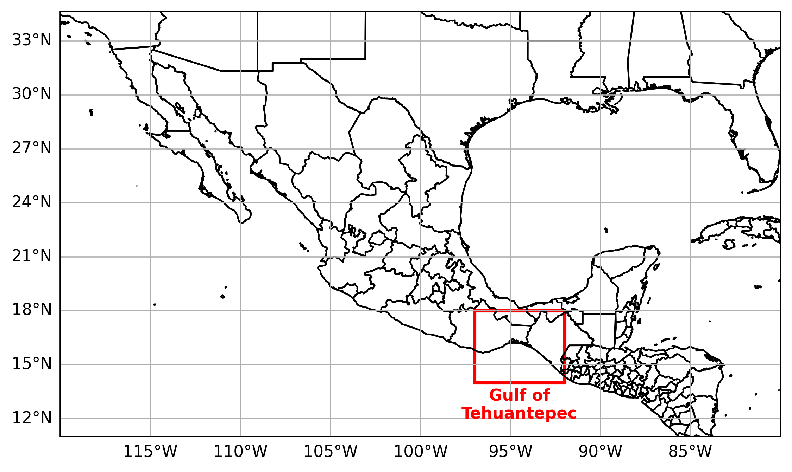
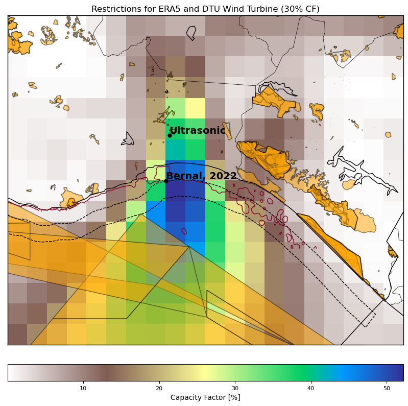
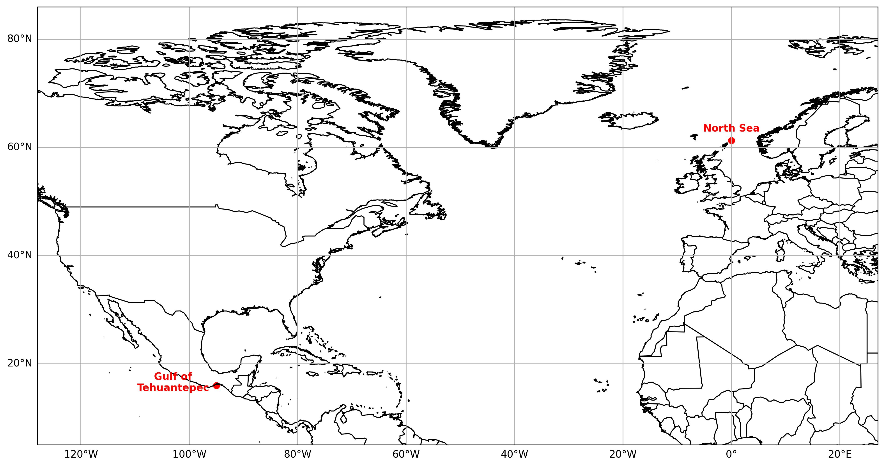
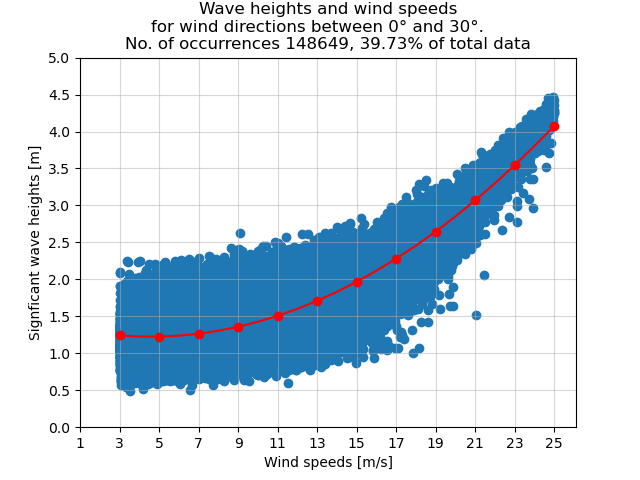
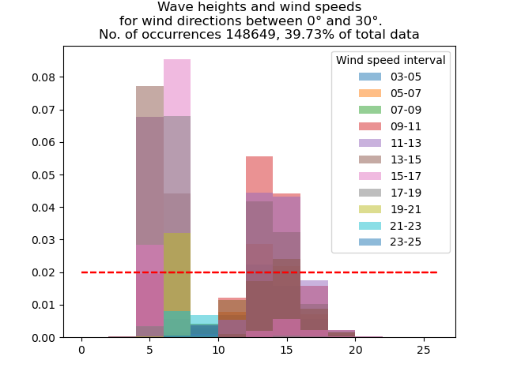
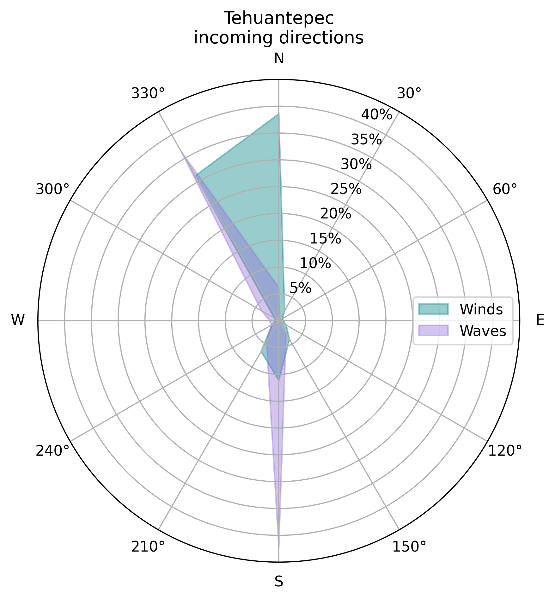
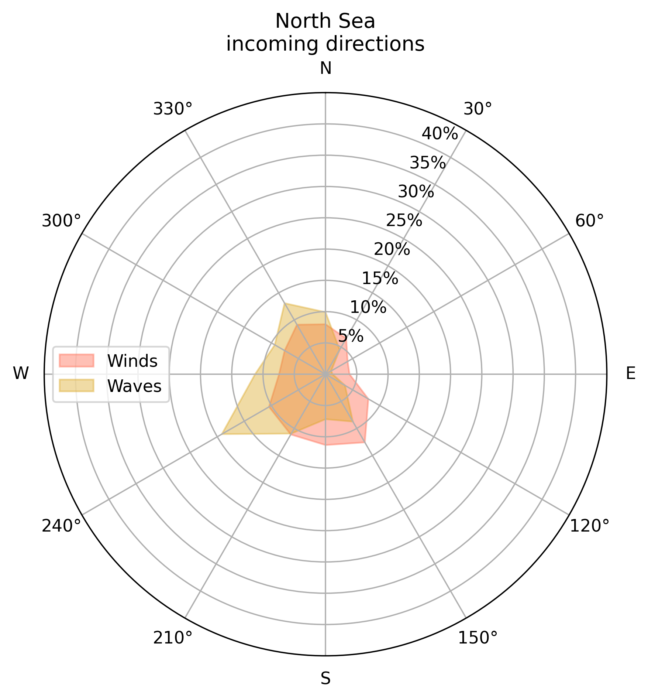
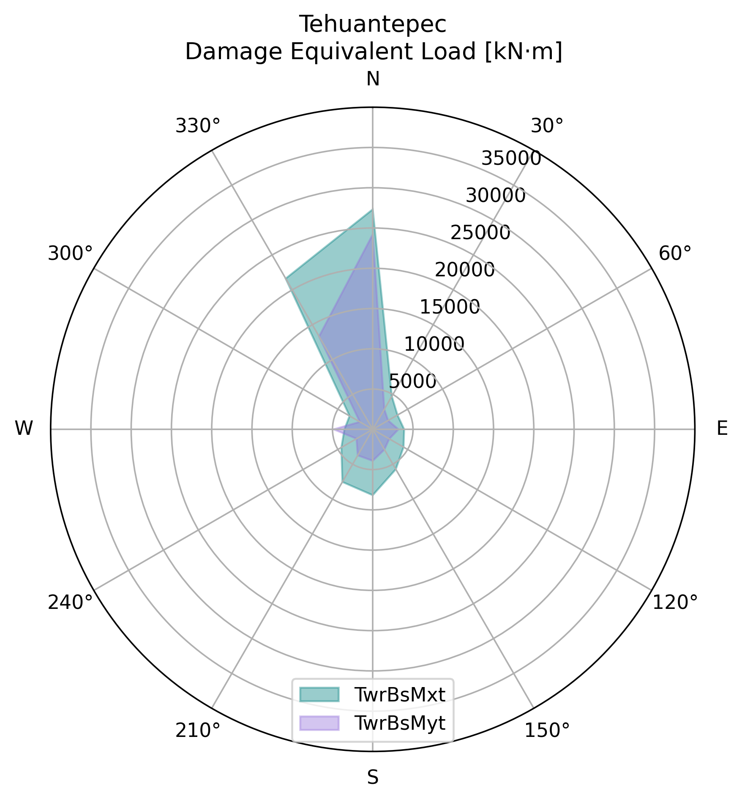
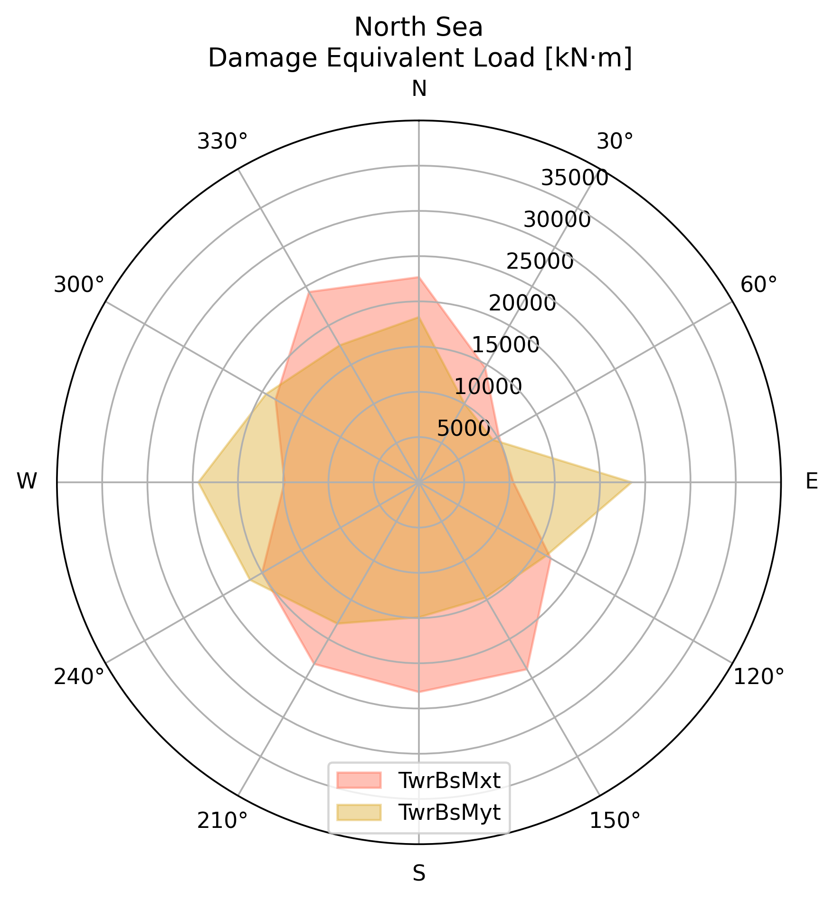

# Performance of an offshore wind turbine in the Gulf of Tehuantepec {#sec-tehuantepec}

# Introduction

Offshore wind energy is gaining increasing attention as a promising
renewable energy source due to its significant advantages over
traditional fossil fuels. Offshore wind turbines can take advantage of
higher and more consistent wind speeds, resulting in higher energy
output than their onshore counterparts. In recent years, there has been
a growing trend toward installing new offshore wind facilities globally
[@gwr_2024], with increasing investments and technological advancements
in offshore wind energy.

In Mexico, some studies have been performed to assess the technical and
economic feasibility of offshore wind in the Gulf of Mexico and the
Pacific Ocean
[@CANULREYES2022211; @arenas-lopezAnalysisOffshoreWind2022; @hernandezgalvezHarnessingOffshoreWind2022].
According to the World Bank Group
[@worldbankgroupOffshoreWindTechnical2020], there are four zones
suitable for floating offshore wind technology (FOWT) in the country:
the Gulf of California, the eastern region of Tamaulipas, the northern
region of the Yucatan Peninsula, and the southern region of Oaxaca at
the Gulf of Tehuantepec being this last zone the area with the highest
wind resources on the country.

The conditions in the Gulf of Tehuantepec include high wind speeds
[@romero-centenoIsthmusTehuantepecWind2003] and high water depth
[@gebco], which allows for exploring the technical feasibility of
floating platforms. This work aims to analyze the performance of an
offshore wind turbine and its platform in the Gulf of Tehuantepec by
analyzing the energy produced and structural loads due to the wind and
sea conditions. Next, a review of studies about fatigue analysis of
offshore wind turbines is given and summarized in table
[1](#tab: review){reference-type="ref" reference="tab: review"}.

Robertson and Jonkman [@robertsonLoadsAnalysisSeveral2011] analyzed the
dynamic response of six offshore platforms for a 5 MW wind turbine
according to the IEC 61400-3 design standard located on the northern
North Sea. These platforms are the MIT/NREL tension leg platform,
OC3-Hywind spar, ITI energy barge, UMaine tension leg platform,
UMaine-Hywind spar, and UMaine semi-submersible. For the different
analyses on each platform, the specifications of the wind turbine and
the metocean data were the same. Also, the properties of every structure
and the mooring system designs were required to develop a fully dynamic
model for each one. With this model, the loads analysis is performed to
identify the ultimate loads and fatigue loads by designing a set of load
cases. With those results, the systems' dynamic response is
characterized and compared with a land-based system.

The load cases designed on [@robertsonLoadsAnalysisSeveral2011] consider
different scenarios, including power production under normal operation
and with fault occurrences, parked with and without faults, using normal
and extreme turbulence models and wind conditions. The different
combinations of the scenarios give a total of 2,190 simulations of each
offshore model. Results were presented in terms of the ratio between the
resulting loads from the floating systems by the corresponding values
from the land-based analysis. For the Ultimate loads, were analyzed the
transverse bending moments of the blade root, of the low-speed shaft at
the main bearing, of the yaw bearing, and of the tower base. For Fatigue
loads, simulations were performed for the in-plane and out-of-plane
blade root bending moments, the 0$^{\circ}$ and 90$^{\circ}$
low-speed-shaft bending moments at the main bearing, and the
side-to-side and fore-aft bending moments in the yaw bearing and in the
tower base.

Tran and Kim [@tranCFDStudyCoupled2018] conducted a CFD simulation of
the OC4 DeepCwind semi-submersible platform for the NREL 5MW turbine
with the objective of analyzing the influences between floating platform
motions and wind turbine aerodynamic performance considering the
influence of wind and waves, results were compared with an OpenFAST
simulation. They analyze the surge, heave, pitch, and mooring line
tension response along the thrust and power coefficients under an
operating condition. Also, aerodynamic loads at different positions of
the tower were obtained.

Hashemi et al. [@hashemiAssessmentHurricaneGenerated2021] simulated the
effects of wind and wave loads generated by the hurricanes Carol and
1938, with peaks wind velocities of 49 and 45 m/s, respectively. They
used a monopile offshore wind turbine located on the US East Coast to
assess the sub-structural response to load variability. From OpenFAST,
they analyzed the total tower base moment at the monopile base and the
displacement at the transition point of the tower and the monopile
structure.

Zambrano et al. [@zambranoDynamicModelingDeepwater2006] analyzed the
motion response of a floating structure designed to support three wind
turbines. It was performed under different storm conditions of the sea
states in the Gulf of Mexico. Analysis of the response amplitude
operator was carried out for surge, heave, and pitch for those
conditions and for two proposed turbines.

The feasibility of a floating offshore wind farm in United Arab Emirates
was studied by Al Qubaisi et al. [@alqubaisiFeasibilityStudyDesign2018].
The criteria for the selection of the site include the water depth and
wind speed; for the proposed location, the water depth is between 10 and
30 m, and the average wind speed above 5.4 m/s. Costs of the
installation were estimated and compared with the Gemini offshore wind
farm located in the Netherlands. The study does not analyze the
performance of the proposed technology under the site conditions.

In the Tehuantepec Isthmus, Bernal Camacho et al.
[@bernal-camachoTechnicalAssessmentOffshore2022] estimated the wind
potential of the 5 MW NREL wind turbine and analyzed the dynamic
behavior of the semisubmersible OC4 DeepCwind platform through numerical
analysis using ANSYS, under the following environmental scenarios: the
highest probability of occurrence and the most extreme conditions
(Hurricane Barbara, 2019). Results analyze the variations in the heave,
pitch, and surge of the platform under those conditions in terms of the
displacement of the center of gravity (CG) and the parameter $d/a$ where
$a$ is the distance from the keel to the upper deck of the external
floats, and $d$ is the required draft. For extreme conditions, authors
consider necessary the use of safety and stabilization methods.

::: {#tab: review}
+:------+:------------+:------+:------+:------+:------------+
| Refe  | Gap         | Techn | Site  | Bas   | Comparison  |
| rence |             | ology | condi | eline | criteria    |
|       |             | t     | tions |       |             |
|       |             | ested |       |       |             |
+-------+-------------+-------+-------+-------+-------------+
| \*    | Understand  | NREL  | North | NREL  | Sea-to-land |
| Robe  | the         | off   | Sea   | 5MW   | ratio of    |
| rtson | fundamental | shore |       | land  | Blade-Root  |
| and   | design      | 5MW   |       | based | Bending     |
| Jon   | trafe-off   | with  |       |       | Moment,     |
| kman, | between the | the   |       |       | Low-        |
| 2011  | different   | MIT   |       |       | Speed-Shaft |
| [     | concepts    | /NREL |       |       | Bending     |
| @robe |             | TLP,  |       |       | Moment,     |
| rtson |             | U     |       |       | Yaw-Bearing |
| Loads |             | Maine |       |       | Bending     |
| Analy |             | TLP,  |       |       | Moment,     |
| sisSe |             | OC3   |       |       | Tower-Base  |
| veral |             | H     |       |       | Bending     |
| 2011] |             | ywind |       |       | Moment,     |
|       |             | spar, |       |       | Blade-Root  |
|       |             | UMain |       |       | Bending     |
|       |             | spar, |       |       | Momente     |
|       |             | U     |       |       | In-Plane,   |
|       |             | Maine |       |       | Blade-Root  |
|       |             | s     |       |       | Bending     |
|       |             | emisu |       |       | Moment      |
|       |             | bmers |       |       | Ou          |
|       |             | ible, |       |       | t-of-Plane, |
|       |             | ITI   |       |       | Low-        |
|       |             | E     |       |       | Speed-Shaft |
|       |             | nergy |       |       | Bending     |
|       |             | barge |       |       | Moment 0°,  |
|       |             |       |       |       | Low-        |
|       |             |       |       |       | Speed-Shaft |
|       |             |       |       |       | Bending     |
|       |             |       |       |       | Moment 90°, |
|       |             |       |       |       | Yaw-Bearing |
|       |             |       |       |       | Bending     |
|       |             |       |       |       | Moment      |
|       |             |       |       |       | Si          |
|       |             |       |       |       | de-to-Side, |
|       |             |       |       |       | Yaw-Bearing |
|       |             |       |       |       | Bending     |
|       |             |       |       |       | Moment      |
|       |             |       |       |       | Fore-Aft,   |
|       |             |       |       |       | Tower-Base  |
|       |             |       |       |       | Bending     |
|       |             |       |       |       | Moment      |
|       |             |       |       |       | Si          |
|       |             |       |       |       | de-to-Side, |
|       |             |       |       |       | Tower-Base  |
|       |             |       |       |       | Bending     |
|       |             |       |       |       | Moment      |
|       |             |       |       |       | Fore-Afte   |
+-------+-------------+-------+-------+-------+-------------+
| \* Ma | Dynamic     | 5MW   | Spe   |       | Loads on    |
| et    | response of | tu    | cific |       | Tower base  |
| al,   | a FOWT      | rbine | condi |       | of          |
| 2014  | under       | with  | tions |       | Wind-wave,  |
| [     | different   | OC3-H | of    |       | wave-only.  |
| @maWi | en          | ywind | waves |       | Power       |
| ndwav | vironmental | spar  | (T    |       | spectrum of |
| eIndu | conditions  | -type | =10s, |       | platform    |
| cedDy | using a     | stru  | H=6m) |       | heave,      |
| namic | numerical   | cture | and   |       | surge and   |
| 2014] | simulation  |       | wind  |       | pitch       |
|       | method      |       | vel   |       | motions by  |
|       |             |       | ocity |       | wind-wave   |
|       |             |       | of    |       | and         |
|       |             |       | 11.4  |       | wave-only   |
|       |             |       | m/s   |       |             |
+-------+-------------+-------+-------+-------+-------------+
| \*    | Identify    | NREL  | Ij    |       | Parameters  |
| M     | the         | 5MW   | muden |       | for the     |
| orató | potential   | mon   | sh    |       | design of   |
| et    | relevant    | opile | allow |       | the         |
| al,   | design load | from  | water |       | ro          |
| 2017  | cases from  | the   | site, |       | tor/nacelle |
| [@mor | the IEC for | OC3   | Dutch |       | assembly    |
| atoUl | su          | pr    | North |       | and the     |
| timat | b-structure | oject | Sea   |       | suport      |
| eLoad | design      |       |       |       | structure   |
| sResp |             |       |       |       | as flapwise |
| onse2 |             |       |       |       | (out        |
| 017a] |             |       |       |       | -of-plane), |
|       |             |       |       |       | and         |
|       |             |       |       |       | edgewise    |
|       |             |       |       |       | (in-plane)  |
|       |             |       |       |       | moment at   |
|       |             |       |       |       | the root of |
|       |             |       |       |       | the blade,  |
|       |             |       |       |       | the         |
|       |             |       |       |       | overturning |
|       |             |       |       |       | moment at   |
|       |             |       |       |       | the seabed  |
|       |             |       |       |       | (mudline    |
|       |             |       |       |       | moment),    |
|       |             |       |       |       | pitch angle |
|       |             |       |       |       | and GenTq.  |
+-------+-------------+-------+-------+-------+-------------+
| \*    | Develop a   | Deep  | Spe   | Re    | Surge,      |
| Tran  | hi          | Cwind | cific | sults | heave and   |
| and   | gh-fidelity | semis | condi | were  | pitch       |
| Kim,  | flui        | ubmer | tions | com   | motions,    |
| 2018  | d-structure | sible | of    | pared | mooring     |
| [     | simulation  | flo   | wind  | with  | cables      |
| @tran | that        | ating | sp    | a     | tension,    |
| CFDSt | consider    | pla   | eeds, | FAST  | thrust      |
| udyCo | the         | tform | rot   | simul | c           |
| upled | influence   | with  | ating | ation | oefficient, |
| 2018] | of          | the   | speed |       | power       |
|       | aero-h      | NREL  | of    |       | c           |
|       | ydrodinamic | 5MW   | the   |       | oefficient, |
|       | coupling    | tu    | rotor |       | platform    |
|       | due to the  | rbine | b     |       | surge       |
|       | dynamic     |       | lade, |       | respons,    |
|       | motion of a |       | wave  |       | blade root  |
|       | FOWT        |       | h     |       | force,      |
|       |             |       | eight |       | blade root  |
|       |             |       | and   |       | moment.     |
|       |             |       | wave  |       | Tower based |
|       |             |       | p     |       | force       |
|       |             |       | eriod |       | considering |
|       |             |       | of 11 |       | Tower only  |
|       |             |       | m/s,  |       | and         |
|       |             |       | 11.89 |       | Blades+To   |
|       |             |       | rpm,  |       | wer+Nacelle |
|       |             |       | 7.14  |       |             |
|       |             |       | m and |       |             |
|       |             |       | 14.3  |       |             |
|       |             |       | s.    |       |             |
+-------+-------------+-------+-------+-------+-------------+
| \* Xu | Develop a   | NREL  | Cape  |       | O           |
| et    | the average | 5MW   | Eliza |       | ut-of-plane |
| al.,  | conditional | wind  | beth, |       | bending     |
| 2020  | exceedance  | tu    | US    |       | moment,     |
| [@xu  | rate method | rbine | coast |       | tower-base  |
| Extre | for         | p     |       |       | s           |
| meLoa | estimating  | laced |       |       | ide-to-side |
| dsAna | extreme     | on    |       |       | bending     |
| lysis | loads on    | the   |       |       | moment,     |
| 2020] | FOWT        | Deep  |       |       | Tower-base  |
|       |             | Cwind |       |       | fore-aft    |
|       |             | s     |       |       | bending     |
|       |             | emi-s |       |       | moment,     |
|       |             | ubmer |       |       | anchor      |
|       |             | sible |       |       | tension     |
|       |             | pla   |       |       |             |
|       |             | tform |       |       |             |
+-------+-------------+-------+-------+-------+-------------+
| \*    | Ch          | 5MW   | US    | Perce | Total tower |
| Ha    | arachterize | off   | east  | ntage | base moment |
| shemi | the spatial | shore | coast | c     | at the      |
| et    | variability | mon   |       | hange | monopile    |
| al.,  | of extreme  | opile |       | of    | base        |
| 2021  | wind and    |       |       | the   | (reactMYss) |
| [@    | wave loads  |       |       | diffe | and the     |
| hashe | under       |       |       | rence | d           |
| miAss | extreme     |       |       | to    | isplacement |
| essme | hurricane   |       |       | the   | (PtfmSurge) |
| ntHur | conditions  |       |       | mean  |             |
| rican |             |       |       | of    |             |
| eGene |             |       |       | the   |             |
| rated |             |       |       | five  |             |
| 2021] |             |       |       | p     |             |
|       |             |       |       | oints |             |
|       |             |       |       | spat  |             |
|       |             |       |       | ially |             |
|       |             |       |       | lo    |             |
|       |             |       |       | cated |             |
+-------+-------------+-------+-------+-------+-------------+
| \*    | Analyze the | IEA   | Av    | Compa | RAOs of     |
|       | technical   | 15 MW | erage | rison | heave,      |
| Papi  | i           | and   | met   | be    | pitch and   |
| and   | mplications | NREL  | ocean | tween | surge.      |
| Bac   | of          | 5 MW, | data  | the   | Ratio       |
| hini, | upscaling   | both  | from  | p     | offshore to |
| 2022  | floating    | over  | the   | erfor | onshore of  |
| [@p   | wind        | the   | west  | mance | GenPwr,     |
| apiTe | turbines to | Deep  | coast | of    | GenTq,      |
| chnic | understand  | CWind | of    | the   | RotSpeed,   |
| alCha | how the     | s     | the   | two   | RotThrust,  |
| lleng | benefits of | emi-s | US    | turb  | RtAeroFxh,  |
| esFlo | upscaling   | ubmer |       | ines. | TwrBsMyt,   |
| ating | can impact  | sible |       | Ratio | TwrBsMxt,   |
| 2022] | not only    | pla   |       | off   | TwrBsFxt,   |
|       | turbine     | tform |       | shore | YawBrFxp,   |
|       | cost per    |       |       | to    | YawBrMyp,   |
|       | installed   |       |       | on    | YawBrMxp,   |
|       | kW but also |       |       | shore | TipDxc1,    |
|       | the cost of |       |       |       | TipDxc2,    |
|       | the         |       |       |       | TipDxc3,    |
|       | floater,    |       |       |       | TTDspFA,    |
|       | mooring     |       |       |       | TipDyc1,    |
|       | lines, and  |       |       |       | TipDyc2,    |
|       | a           |       |       |       | TipDyc3,    |
|       | ncillaries. |       |       |       | TTDspSS,    |
|       |             |       |       |       | RootMxb1,   |
|       |             |       |       |       | RootMxb2, , |
|       |             |       |       |       | RootMxb3, , |
|       |             |       |       |       | RootMyb1,   |
|       |             |       |       |       | RootMyb2,   |
|       |             |       |       |       | RootMyb3    |
+-------+-------------+-------+-------+-------+-------------+
| \*    | The         | OC4   | Most  |       | Response    |
|       | feasibility | Deep  | pro   |       | Amplitude   |
| Bern  | of a        | Cwind | bable |       | Operators   |
| al-Ca | floating    | semis | and   |       | (RAOs) of   |
| macho | platform    | ubmer | most  |       | Surge,      |
| et    | under the   | sible | ex    |       | Heave and   |
| al.,  | wave and    | pla   | treme |       | Pitch of    |
| 2022  | wind        | tform | condi |       | the         |
| [@b   | conditions  |       | tions |       | platform    |
| ernal | of the Gulf |       | at    |       | for         |
| -cama | of          |       | the   |       | different   |
| choTe | Tehuantepec |       | Gulf  |       | c           |
| chnic |             |       | of    |       | ombinations |
| alAss |             |       | T     |       | of the d/a  |
| essme |             |       | ehuan |       | parameter   |
| ntOff |             |       | tepec |       | and,        |
| shore |             |       |       |       | d           |
| 2022] |             |       |       |       | isplacement |
|       |             |       |       |       | of the      |
|       |             |       |       |       | platform    |
+-------+-------------+-------+-------+-------+-------------+
| \*    |             |       |       |       |             |
+-------+-------------+-------+-------+-------+-------------+

: Literature review on dynamical analysis of offshore wind turbines.
:::

Previous studies give an overview of relevant parameters to be analyzed
on wind turbine performance. In this study, we carry out a performance
analysis of a floating offshore wind turbine under the specific metocean
conditions present on the Tehuantepec Isthmus using the OpenFAST
software. Those relevant conditions, characterized by wind speeds, wave
period, significant wave height, and wind and wave directions, are
obtained from the ERA5 reanalysis dataset. Due to the lack of studies on
offshore wind turbine performance in Mexico, particularly on floating
technology, the results are compared with the same technology in
metocean conditions in the North Sea. The assessment presented in this
research will facilitate direct comparisons with established offshore
wind installations at other locations, providing decision-makers with
valuable insights into the prospective future of wind energy in the
region.

The chapter is structured as follows. Section
[2](#sec: data_meth){reference-type="ref" reference="sec: data_meth"}
describes the location and characteristics of the sites, technology and
data, also, the methodology to delimit the cases is given. The analysis
and comparison of the results are presented in section
[3](#sec: results){reference-type="ref" reference="sec: results"}, and
finally, section [4](#sec: conc){reference-type="ref"
reference="sec: conc"} presents the conclusions.

# Data and methodology {#sec: data_meth}

## Study area and baseline

The study area for this research is delimited to the Gulf of
Tehuantepec, located on the southeast side of Mexico on the Pacific
Ocean, as shown in Figure [1](#fig: map_mexico){reference-type="ref"
reference="fig: map_mexico"}. The interest in this site, as previously
described, is due to the high wind velocities present throughout the
year. Figure [2](#fig: map_restrictions){reference-type="ref"
reference="fig: map_restrictions"} shows the delimitation of potential
areas using the same methodology as in [@CANULREYES2022211]; however,
the bathymetry until 50 m, indicated by a red line is very near the
coast, and higher velocities are away the coast, with a higher depth,
therefore, in this study, we evaluate the performance of a FOWT
technology.

The turbine's performance at the proposed site will be compared with the
same technology but in a different place; since there are no other
offshore facilities in Mexico, we propose a baseline site in the North
Sea. The study zone and the baseline site are shown in Figure
[3](#fig: map_baseline){reference-type="ref"
reference="fig: map_baseline"}. Both sites present ocean depth
conditions for FOWT, usually above 50 m. For the selected locations, the
water depth at the Gulf of Tehuantepec and the North Sea is 83 m and 168
m, respectively [@gebco].

<figure>
<figure id="fig: map_mexico">

<figcaption>Study area</figcaption>
</figure>
<figure id="fig: map_restrictions">

<figcaption>Technical delimitation of potential zone</figcaption>
</figure>
<figure id="fig: map_baseline">

<figcaption>Study area and baseline site located at the North
Sea.</figcaption>
</figure>
<figcaption>Figure <a href="#fig: map_mexico" data-reference-type="ref"
data-reference="fig: map_mexico">1</a> shows the delimitation of the
study area at the Gulf of Tehuantepec, located on Mexico’s southeast.
Figure <a href="#fig: map_restrictions" data-reference-type="ref"
data-reference="fig: map_restrictions">2</a> shows the delimitation of
potential areas using the same methodology as in : dashed lines indicate the
distance from the coast until 44 km, yellow polygons indicate natural
protected areas, and red line shows the bathymetry until 50 m depth.
Figure <a href="#fig: map_baseline" data-reference-type="ref"
data-reference="fig: map_baseline">3</a> shows the location of the study
area and the baseline site that is used to compare the performance of
the technology.</figcaption>
</figure>

## Data

To analyze the effects of fatigue on the device during a typical
turbine's lifetime, data from 25 years was used. The metocean data was
obtained from the ERA5 reanalysis dataset from 1996 to 2020 with an
hourly resolution, using a bi-linear interpolation at the points
indicated in Figure [3](#fig: map_baseline){reference-type="ref"
reference="fig: map_baseline"}. The next variables were extracted:

-   Significant wave height \[m\]

-   Peak wave period \[s\]

-   Wave direction \[°\]

-   Wind direction \[°\]

-   Wind speed \[m/s\]

The technology selected to evaluate its performance was the 15-MW
offshore reference wind turbine developed by NREL
[@evangaertnerDefinitionIEAWind2020] with the UMaine semisubmersible
platform [@allenDefinitionUMaineVolturnUSS2020]. The main parameters of
the turbine and the platform are shown in Table
[2](#tab: turbine_par){reference-type="ref"
reference="tab: turbine_par"}.

::: {#tab: turbine_par}
  **Parameter**                                      **Value**
  -------------------------------- ---------------------------
  **Turbine rating \[MW\]**                                 15
  **Turbine class \[-\]**                         IEC Class 1B
  **Hub height \[m\]**                                     150
  **Rotor diameter \[m\]**                                 240
  **Cut-in wind speed \[m/s\]**                              3
  **Rated wind speed \[m/s\]**                           10.59
  **Cut-out wind speed \[m/s\]**                            25
  **Platform type**                            Semisubmersible
  **Mooring system**                 Three-line chain catenary

  : Parameters of the 15 MW offshore reference wind turbine with a
  semisubmersible platform, developed by NREL
  [@evangaertnerDefinitionIEAWind2020] and UMaine
  [@allenDefinitionUMaineVolturnUSS2020].
:::

## Methodology

In the first stage, the wind speeds for both sites were analyzed. Then,
energy production was estimated by evaluating the wind speed time series
in a fitted function for the wind turbine power curve.

To compare the FOWT's performance under the metocean conditions on the
Gulf of Tehuantepec against the conditions on the North Sea, we proposed
using the fatigue loads as an indicator, particularly the Tower base
side-to-side moment (TwrBsMxt) and the Tower base fore-aft moment
(TwrBsMyt). These time series are outputs of the OpenFAST software.

In the next step, we follow the structure of the IEC 61400-3-2 standard
for the design of floating offshore wind turbines [@IECTS61400322019] to
define the cases to be performed for the wind turbine, in particular the
Design Load Case (DLC) 1.2 for fatigue analysis. Since the DLCs are
standards for design and require testing of all possible scenarios, we
use them as suggestions for the simulation inputs in this research since
the actual metocean conditions of the sites are available. DLC 1.2
suggests a normal turbulence model for the wind condition to be
generated in bin intervals of at least 2 m/s between the wind turbine
cut-in and cut-out speeds. This is to generate a wind field from 3 m/s
to 25 m/s. To generate these wind fields, the Turbsim software, a
stochastic full-field turbulent wind simulator, is used
[@jonkmanTurbSimUserGuide2014].

To delimit the cases for analysis and set up the matrix simulation for
OpenFAST, DLC 1.2 suggests simulating for each joint probability of sea
states at each 2 m/s wind bin interval, considering the misalignment and
multidirectional between wind and waves. Since we are using the actual
conditions of the sites and are not performing a design process, the
process of constraining the input data is as follows:

-   The complete data set is segmented into bins for each 30° for the
    wind directions (0°-30°, 30°-60°, \..., 330°-360°).

-   For the constrained data in each wind bin direction, we fitted a
    2nd-grade polynomial between the wind speeds in the interval
    $v_{cut-in}$ to $v_{cut-out}$ and the significant wave heights. With
    that equation, we can get a "representative height\" for each wind
    speed.

-   Finally, the frequencies of each wave period and direction that
    occur into the wind speed interval (3-5 m/s, 5-7 m/s, \..., 23-25
    m/s) are obtained.

-   Each input for a simulation would be defined as a wave period with a
    representative height and direction for each wind speed interval for
    each wind interval direction.

An example of defining the cases for a bin direction for the Gulf of
Tehuantepec is shown in Figure
[5](#fig: metocean_gulf){reference-type="ref"
reference="fig: metocean_gulf"}. The left side of the figures shows the
polynomial fit between wind speed and wave height, and the histograms on
the right side show the wave period for each wind speed bin.

The simulations were conducted using data from previous classifications
of cases. Each simulation is identified by a unique combination of wind
speed magnitude and direction, wave period, significant wave height, and
wave directions. Each event may occur multiple times, and its frequency
has been quantified.

<figure id="fig: metocean_gulf">
<figure>

</figure>
<figure>

</figure>
<figcaption>Example of case definition for a bin direction for the Gulf
of Tehuantepec. The left side shows the polynomial fit between the wind
speeds and the wave heights. The right side shows the histograms for the
periods at each wind speed bin (3-5 m/s, 5-7 m/s, ...,23-25
m/s).</figcaption>
</figure>

Once the simulations were performed, we analyzed the TwrBsMxt and
TwrBsMyt time series obtained from OpenFAST. These variables represent
the moments at the base of the tower, and to compare them between both
sites, we applied a rainflow counting algorithm, a method used to
identify and count stress cycles in time series data, typically for
fatigue analysis. We calculated the Damage Equivalent Load (DEL) for
each bin direction using this method. The calculus of the DEL is
described in Section [\[sub: del\]](#sub: del){reference-type="ref"
reference="sub: del"}.

In summary, this study's methodology first analyzed wind resources at
the two sites and then estimated energy production under specific
metocean conditions. Following IEC standards for floating offshore wind
turbine design, we used Turbsim to generate wind fields and OpenFAST for
fatigue load simulations. By constraining the input data based on actual
site conditions and accounting for the joint probability of sea states
and wind directions, we set up a detailed simulation matrix to calculate
the DEL. This approach provided an understanding of the environmental
conditions in the Gulf of Tehuantepec and the North Sea, allowing for
robust performance analysis of the wind turbine. A diagram summarizing
the methodology is shown in Figure [6](#fig: meth){reference-type="ref"
reference="fig: meth"}.

{reference-type="ref"
reference="sec: data_meth"}](images/meth_diagram_fowt_mx.png){#fig: meth
width="70%"}

# Results and discussion {#sec: results}

## Wind resources and energy production

We analyzed the wind resources and estimated the energy production of an
IEA 15 MW offshore wind turbine at the Gulf of Tehuantepec and a
baseline site in the North Sea. Figure
[7](#fig: boxplots_windspeed){reference-type="ref"
reference="fig: boxplots_windspeed"} shows the monthly distribution of
wind speeds over 25 years (1996-2020). Dashed lines indicate the
turbine's cut-in and cut-out speeds at 3 and 25 m/s, respectively. Both
locations exhibit similar seasonal trends, with lower wind speeds during
summer, May to July, and higher speeds in winter, December to February.
However, the North Sea generally shows higher average speeds and more
pronounced extreme events.

In terms of Capacity Factor, the monthly distribution of the energy
produced is shown in Figure [8](#fig: boxplots_cf){reference-type="ref"
reference="fig: boxplots_cf"}. Due to the distribution of wind speeds in
Tehuantepec, the energy produced has a wider range compared to the North
Sea, which has smaller intervals of energy values. In the previously
identified season of lower wind speeds, there is also a low season of
energy production, in May and June, only for Tehuantepec. The annualized
values of the Capacity Factors are 0.54 and 0.63 for Tehuantepec and the
North Sea, respectively.

{#fig: boxplots_windspeed
width="\\textwidth"}

{#fig: boxplots_cf width="\\linewidth"}

Figure [9](#fig: energy_rose){reference-type="ref"
reference="fig: energy_rose"} presents the annualized energy
distribution across wind direction bins. The plot shows that the
north-northeast direction dominates Tehuantepec's wind resource, whereas
the North Sea exhibits a broader, more uniform distribution. The
annualized energy values are 70,134.79 MWh and 82,130.85 MWh for
Tehuantepec and the North Sea, respectively, with the latter site
producing approximately 17% more energy than the former.

{#fig: energy_rose
width="50%"}

## Damage Equivalent Load analysis

The fatigue performance of the FOWT was evaluated through OpenFAST
simulations. Here, an event is defined as a combination of wind speed,
significant wave height, wave direction and peak wave period. Over the
25-year period, 186360 events were identified at Tehuantepec and 204102
at the North Sea. These events are grouped into 1772 unique simulation
cases for Tehuantepec and 5321 for the North Sea.

In the first stage, the wind and wave directions are analyzed to
understand the metocean conditions at each site. This information is
directly obtained from ERA5. Figure
[10](#fig: incoming_conditions){reference-type="ref"
reference="fig: incoming_conditions"} shows the distribution of wind
speeds and wave conditions at both sites. At Tehuantepec, the wind
predominantly comes from the north-northeast, and the wave conditions
display two prominent directional peaks: one from the northeast and
another from the south. Due to the wind distribution, waves incoming
from the north are likely wind-induced. In contrast, the North Sea
exhibits a more consistent wind and wave regime, which could lead to
more uniform and predictable loading patterns on the turbine structure.

<figure id="fig: incoming_conditions">
<figure>

</figure>
<figure>

</figure>
<figcaption>Distributions of wind speeds and wave
conditions.</figcaption>
</figure>

To assess fatigue damage, a rainflow counting algorithm was applied to
the tower base moments, side-to-side (TwrBsMxt) and fore-to-aft
(TwrBsMyt), to compute the Damage Equivalent Load (DEL) for each set of
simulations. Figure [11](#fig: del_comparison){reference-type="ref"
reference="fig: del_comparison"} compares the DEL values at both sites.
At Tehuantepec, the DEL values for both side-to-side and fore-aft
moments are strongly influenced by the predominant wind direction,
indicating that fatigue damage is primarily wind-driven. In contrast, at
the North Sea, the DEL values exhibit a more uniform distribution,
reflecting the combined influence of wind and wave loading.

<figure id="fig: del_comparison">
<figure>

</figure>
<figure>

</figure>
<figcaption>Comparison of DEL values for the tower base side-to-side
(TwrBsMxt) and fore-to-aft (TwrBsMyt) moments.</figcaption>
</figure>

To assess the impact of fatigue loads per unit of energy generated, we
propose calculating the indicator $\text{DEL}/\text{Energy}$ for each
directional bin. This metric represents the structural fatigue effects
relative to energy production. In the case of Tehuantepec, we can
identify the directional bins where the indicator shows small fatigue
effects, as the energy generation is high in those directions. Peaks in
the indicator for eastern and western directions are due to the lack of
energy generation, as previously mentioned. In the North Sea case, the
indicator remains homogeneously distributed, except for a peak in the
east for the TwrBsMyt, which is caused by the absence of energy
generation in that direction, as shown in Figure
[9](#fig: energy_rose){reference-type="ref"
reference="fig: energy_rose"}.

<figure id="fig: indicator">
<figure>

</figure>
<figure>

</figure>
<figcaption>Comparison of the indicator DEL per unit of energy
generated.</figcaption>
</figure>

The proposed indicator helps identify the optimal wind directions for
turbine orientation, maximizing energy capture while minimizing exposure
to fatigue loads in low-energy directions. Figure
[13](#fig: comparison_indicator){reference-type="ref"
reference="fig: comparison_indicator"} presents the normalized DEL and
the proposed indicator, illustrating the relationship between fatigue
loads and energy generation. In directions where damage is high,
production is also significant, leading to lower indicator values. For
Tehuantepec, it is recommended to position turbines primarily in the
dominant north and northeast directions, as other directions contribute
minimally to energy generation while inducing fatigue loads. In
contrast, the North Sea shows a more uniform distribution of both damage
and energy production, allowing for a wider control position. The
indicator remains consistent, except in the east direction, where the
lack of energy results in a higher indicator value.

<figure id="fig: comparison_indicator">
<figure>

</figure>
<figure>

</figure>
<figcaption>Comparison of the normalized DEL and proposed
indicator.</figcaption>
</figure>

# Key insights {#sec: conc}

This study analyzed the performance of a 15 MW floating offshore wind
turbine in the Gulf of Tehuantepec and compared it with a baseline site
in the North Sea, focusing on wind resources, energy production, and
fatigue loads. Meteorological and oceanic conditions were characterized
using reanalysis datasets, and high-resolution simulations were
performed using OpenFAST to capture turbulence variability.

The Gulf of Tehuantepec exhibits strong wind resources, particularly
from the north-northeast direction, while the North Sea shows
homogeneous wind incoming directions. Fatigue loads, measured through
the Damage Equivalent Load (DEL), were higher in Tehuantepec, especially
in dominant wind directions, indicating significant fatigue damage due
to strong wind-driven loads. In contrast, the North Sea exhibited a more
uniform distribution of fatigue loads, reflecting the combined influence
of wind and wave conditions.

The proposed DEL/Energy indicator revealed that in Tehuantepec, the
north and northeast directions are optimal for turbine orientation,
offering high energy production with lower fatigue damage per unit of
energy. In the North Sea, the indicator showed a more uniform
distribution, allowing greater flexibility in turbine positioning,
though the east direction should be avoided due to higher fatigue damage
relative to energy production.

The Gulf of Tehuantepec offers significant potential for offshore wind
energy, its higher fatigue loads and seasonal variability require
careful turbine design, placement, and maintenance strategies. These
insights can guide future offshore wind projects in Mexico and similar
regions.
